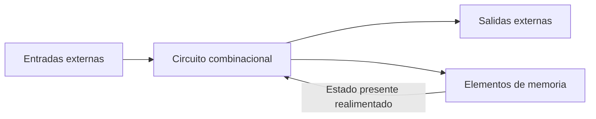
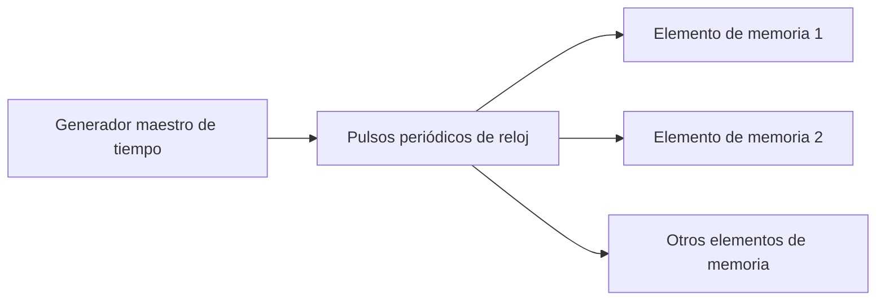
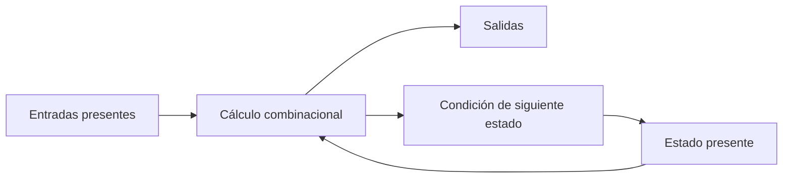

# Retroalimentación digital

## 1. De la lógica combinacional a la lógica secuencial

Los circuitos estudiados hasta ahora han sido **combinacionales**: sus salidas en un instante determinado dependen completamente de las entradas presentes en ese mismo instante.

Si $X$ representa el conjunto de entradas y $Y$ el conjunto de salidas, su comportamiento puede expresarse como:

$$
Y=F(X)
$$

El circuito no necesita conocer qué ocurrió anteriormente. Cuando se presenta la misma combinación de entradas, vuelve a producir la misma combinación de salidas después del retardo de propagación.

La mayoría de los sistemas digitales prácticos también contienen **elementos de memoria**. En estos sistemas, el comportamiento no puede describirse únicamente mediante las entradas actuales, porque la información almacenada sobre acontecimientos anteriores también influye en el resultado.

Esta combinación de lógica y memoria da origen a la **lógica secuencial**.

> [!note]
> La palabra *secuencial* indica que importa la sucesión temporal de entradas, estados y salidas. Dos sistemas con la misma entrada presente pueden responder de manera distinta si sus estados almacenados son diferentes.

## 2. Circuito secuencial

Un **circuito secuencial** está formado por:

- Un circuito combinacional.
- Elementos de memoria.
- Un camino de realimentación.

Los elementos de memoria almacenan información binaria. Esta información regresa al circuito combinacional y participa, junto con las entradas externas, en la determinación del comportamiento siguiente.



La estructura muestra dos recorridos desde el circuito combinacional:

1. Uno produce las salidas externas.
2. El otro proporciona la información que puede conservar o modificar la memoria.

La memoria devuelve su contenido al circuito combinacional. Este retorno constituye la **realimentación**.

## 3. Realimentación digital

Existe realimentación cuando una señal obtenida dentro del circuito regresa a una entrada interna y participa en una evaluación posterior.

En el modelo secuencial, el camino principal es:

$$
\text{circuito combinacional}
\longrightarrow
\text{elementos de memoria}
\longrightarrow
\text{circuito combinacional}
$$

La realimentación permite que información producida anteriormente se encuentre disponible para el cálculo actual.

### 3.1 Función de la realimentación

Mediante la realimentación, el sistema puede:

- Conservar información binaria.
- Distinguir historias anteriores diferentes.
- Hacer que la salida dependa del estado almacenado.
- Determinar un estado siguiente.
- Ejecutar una sucesión ordenada de operaciones.

Sin el camino de realimentación, la parte combinacional solamente conocería las entradas externas presentes.

> **Ejemplo**
> 
> Considérese un sistema que recibe una entrada $X=0$. Si su memoria contiene $Q=0$, el circuito combinacional recibe el conjunto $(X,Q)=(0,0)$. Si la memoria contiene $Q=1$, recibe $(X,Q)=(0,1)$.
>
> Aunque la entrada externa es la misma, la información total disponible para el circuito es diferente. Por ello, las salidas o el estado siguiente pueden ser distintos.

### 3.2 Un lazo no garantiza memoria confiable

Conectar una salida de regreso a una entrada solamente crea una dependencia circular. Para que la realimentación produzca una memoria útil, el circuito debe:

- Poseer estados binarios identificables.
- Conservar esos estados de forma estable.
- Cambiar entre estados mediante condiciones definidas.
- Respetar una organización temporal.

La interacción entre realimentación y retardos puede causar inestabilidad si el circuito no está diseñado adecuadamente.

## 4. Elementos de memoria

Los **elementos de memoria** son componentes capaces de almacenar información binaria dentro del circuito.

Sus funciones generales son:

- Recibir señales que pueden modificar su contenido.
- Conservar información binaria.
- Entregar esa información al circuito combinacional.

En los circuitos secuenciales temporizados, estos elementos se denominan **flip-flops**. Un flip-flop es una celda binaria capaz de almacenar un bit.

$$
Q\in\{0,1\}
$$

El valor almacenado permanece disponible hasta que una condición de entrada permita modificarlo.

> [!note]
> En este tema solo se introduce la función general del flip-flop como elemento de memoria. Su construcción, tipos, tablas y ecuaciones pertenecen al tema siguiente.

### 4.1 Cantidad de estados

Un elemento que almacena un bit puede representar dos estados:

$$
0\quad\text{o}\quad1
$$

Si un circuito posee $n$ elementos binarios de memoria, puede representar como máximo:

$$
2^n
$$

combinaciones de estado.

Por ejemplo, dos bits de memoria pueden contener:

$$
00,\quad01,\quad10,\quad11
$$

Estas combinaciones representan cuatro estados internos posibles.

## 5. Estado del circuito

El **estado** de un circuito secuencial en un instante determinado es la información binaria almacenada en sus elementos de memoria en ese momento.

El estado resume la parte del pasado que el circuito necesita conservar para decidir su comportamiento futuro.

Se distinguen dos conceptos:

- **Estado presente:** información almacenada actualmente.
- **Estado siguiente:** información que quedará almacenada después del cambio correspondiente.

Si $Q(t)$ representa el estado presente y $Q(t+1)$ el estado siguiente, la transición puede visualizarse como:

$$
Q(t)\longrightarrow Q(t+1)
$$

El estado no almacena necesariamente todas las entradas que han ocurrido. Conserva únicamente la información interna que el diseño necesita.

### 5.1 Entradas, estado y salidas

Un circuito secuencial recibe dos clases de información:

1. Las entradas externas presentes.
2. El estado presente de los elementos de memoria.

Ambas determinan:

- Los valores de las salidas externas.
- La condición de cambio de los elementos de memoria.
- El siguiente estado.

Estas relaciones pueden expresarse conceptualmente como:

$$
Y(t)=F[X(t),Q(t)]
$$

$$
Q(t+1)=G[X(t),Q(t)]
$$

donde:

- $X(t)$ representa las entradas presentes.
- $Q(t)$ representa el estado presente.
- $Y(t)$ representa las salidas.
- $Q(t+1)$ representa el siguiente estado.

> **Ejemplo**
> 
> Supóngase que un sistema almacena un bit que indica si anteriormente recibió una señal de activación.
>
> - Antes de la activación, su estado es $Q=0$.
> - Después de la activación, su estado pasa a $Q=1$.
>
> Si la entrada vuelve luego a $0$, el sistema todavía puede distinguir que la activación ya ocurrió porque conserva $Q=1$. Un circuito combinacional sin memoria no podría realizar esta distinción usando únicamente la entrada presente.

## 6. Comparación entre lógica combinacional y secuencial

| Característica                  | Circuito combinacional      | Circuito secuencial                               |
| ------------------------------- | --------------------------- | ------------------------------------------------- |
| Información utilizada           | Entradas presentes          | Entradas presentes y estado almacenado            |
| Elementos de memoria            | No                          | Sí                                                |
| Realimentación del estado       | No forma parte del modelo   | Sí                                                |
| Dependencia del pasado          | No                          | Mediante el estado                                |
| Descripción                     | Funciones o tabla de verdad | Secuencia temporal de entradas, estados y salidas |
| Resultado ante entradas iguales | El mismo                    | Puede variar si el estado es diferente            |

La diferencia esencial no consiste simplemente en que uno sea más grande o tenga más compuertas. Un circuito es secuencial porque conserva un estado que influye en su comportamiento.

## 7. Importancia del tiempo

Un circuito combinacional puede describirse relacionando cada combinación de entrada con una salida. En un circuito secuencial también debe especificarse:

- El estado antes de la entrada.
- El momento en que la memoria puede cambiar.
- El estado posterior al cambio.
- La sucesión de entradas, salidas y estados.

Por ello, un circuito secuencial se especifica mediante una **secuencia temporal** de:

$$
\text{entradas}\longrightarrow\text{estados}\longrightarrow\text{salidas}
$$

El tiempo determina cuándo se observa el estado presente y cuándo puede convertirse en el siguiente estado.

### 7.1 Retardo de propagación

El **retardo de propagación** es el intervalo entre un cambio aplicado a la entrada de un dispositivo y la aparición del efecto correspondiente en su salida.

Las señales físicas no atraviesan las compuertas de forma instantánea. En una red con realimentación, una señal puede volver a la entrada después de atravesar varios dispositivos, por lo que el orden y la duración de los retardos influyen en el comportamiento.

> **Ejemplo**
> 
> Si una salida se realimenta hacia una entrada, el nuevo valor no regresa de inmediato. Durante el retardo de propagación, algunas partes de la red todavía responden al valor anterior mientras otras comienzan a responder al nuevo.
>
> Esta coexistencia temporal explica por qué los retardos deben considerarse al estudiar circuitos secuenciales.

## 8. Clasificación de los circuitos secuenciales

Los circuitos secuenciales se clasifican según la forma en que el tiempo gobierna sus señales:

1. Circuitos secuenciales asincrónicos.
2. Circuitos secuenciales sincrónicos.

## 9. Circuitos secuenciales asincrónicos

El comportamiento de un circuito secuencial **asincrónico** depende de:

- El orden en que cambian las entradas.
- El instante en que cambian.
- Los retardos internos de propagación.

Sus elementos de memoria pueden estar formados por compuertas lógicas cuyos propios retardos proporcionan el mecanismo temporal necesario.

Por ello, un circuito secuencial asincrónico puede considerarse como:

$$
\boxed{\text{circuito combinacional con realimentación}}
$$

### 9.1 Memoria mediante retardos

Una señal necesita un tiempo finito para propagarse a través de un dispositivo. Cuando las salidas se realimentan, el circuito responde durante cierto intervalo a valores anteriores. Esta relación entre realimentación y demora permite conservar información.

No se necesita necesariamente una unidad física separada de retardo; el retardo interno de las propias compuertas puede ser suficiente.

### 9.2 Inestabilidad

La realimentación entre compuertas puede provocar que un circuito asincrónico se vuelva inestable. La red puede no alcanzar de manera confiable el estado esperado debido a la interacción entre cambios de entrada y retardos internos.

Este problema impone dificultades importantes al diseñador. Por ello, los sistemas asincrónicos son menos comunes que los sincrónicos dentro del enfoque del libro.

> [!warning]
> La ausencia de reloj no significa que el tiempo deje de importar. En un circuito asincrónico, el tiempo y el orden de los cambios son precisamente parte de su comportamiento.

## 10. Circuitos secuenciales sincrónicos

Un circuito secuencial **sincrónico** utiliza señales que afectan los elementos de memoria solamente en instantes discretos de tiempo.

En lugar de permitir cambios en cualquier instante, el sistema establece momentos determinados en los cuales la memoria puede modificarse. Entre estos instantes, el estado permanece disponible para el circuito combinacional.

### 10.1 Señales mediante pulsos

Una posible representación utiliza pulsos de duración limitada:

- Una amplitud representa lógica $1$.
- Otra amplitud, o la ausencia del pulso, representa lógica $0$.

Sin embargo, pulsos procedentes de fuentes independientes pueden llegar a una compuerta con retardos impredecibles. Si no coinciden, la operación puede resultar poco confiable.

Los sistemas sincrónicos prácticos utilizan niveles fijos, como niveles de voltaje, para representar la información binaria y una señal independiente para coordinar el tiempo.

## 11. Generador maestro y reloj

La sincronización se obtiene mediante un dispositivo llamado **generador maestro de tiempo**, que produce un tren periódico de pulsos de reloj.



Los pulsos se distribuyen por el sistema para que los elementos de memoria sean afectados únicamente con la llegada de la señal de sincronización.

### 11.1 Función del reloj

El reloj determina **cuándo** puede cambiar la memoria. Las demás señales especifican **qué** cambio debe realizarse.

En la explicación del libro, el pulso de reloj se aplica a compuertas AND junto con las señales que solicitan cambios. Las salidas de esas compuertas solo transmiten la información cuando coincide el pulso de reloj.

> **Ejemplo**
> 
> Supóngase que una señal de control solicita almacenar un $1$.
>
> - Si no ha llegado el pulso de reloj, el elemento conserva su estado.
> - Cuando llega el pulso autorizado, la señal de control puede modificar la memoria.
>
> La señal de control especifica el nuevo valor; el reloj coordina el instante del cambio.

### 11.2 El reloj no es un dato

El pulso de reloj no representa por sí mismo la información que se almacenará. Su función es sincronizar los cambios para que los elementos del sistema avancen de manera coordinada.

Puede interpretarse como una autorización periódica:

$$
\text{datos: qué cambiar}\qquad\text{reloj: cuándo cambiar}
$$

## 12. Circuitos secuenciales temporizados

Los circuitos secuenciales sincrónicos que aplican pulsos de reloj a las entradas de sus elementos de memoria se denominan **circuitos secuenciales temporizados**.

Son los más utilizados porque:

- Evitan los problemas de inestabilidad destacados para las redes asincrónicas.
- Dividen la operación en pasos discretos.
- Permiten analizar cada paso de forma independiente.
- Coordinan los cambios de múltiples elementos de memoria.

El libro desarrolla exclusivamente circuitos secuenciales temporizados en los temas posteriores.

### 12.1 Secuencia de estados

Si los instantes autorizados se representan como $t_0,t_1,t_2,\ldots$, el comportamiento puede estudiarse paso a paso:

$$
Q(t_0)\longrightarrow Q(t_1)\longrightarrow Q(t_2)\longrightarrow\cdots
$$

Entre dos instantes de sincronización, el estado se conserva. En el instante autorizado, las entradas y el estado presente determinan el estado siguiente.

## 13. Comparación entre sistemas asincrónicos y sincrónicos

| Característica     | Asincrónico                                | Sincrónico o temporizado                  |
| ------------------ | ------------------------------------------ | ----------------------------------------- |
| Momento del cambio | Puede producirse en cualquier instante     | Ocurre en instantes discretos             |
| Factor temporal    | Orden de entradas y retardos               | Pulsos de reloj                           |
| Memoria descrita   | Realimentación y retardos de compuertas    | Elementos de memoria gobernados por reloj |
| Problema destacado | Posible inestabilidad                      | Cambios coordinados                       |
| Uso en el libro    | Solo se introduce                          | Es el tipo desarrollado posteriormente    |
| Forma de análisis  | Depende de secuencias continuas y retardos | Se divide en pasos discretos              |

> **Ejemplo**
> 
> Considérense dos sistemas:
>
> 1. Una red cambia cada vez que se modifica cualquiera de sus entradas y su respuesta depende del orden en que esas modificaciones se propagan.
> 2. Otra red conserva su estado hasta la llegada del siguiente pulso periódico.
>
> El primer sistema es asincrónico. El segundo es sincrónico o temporizado.

## 14. Importancia de la retroalimentación

La realimentación hace posible que un sistema digital posea estado. Su operación puede resumirse así:

1. Las entradas externas y el estado presente llegan al circuito combinacional.
2. El circuito produce las salidas externas.
3. También determina la condición del estado siguiente.
4. Los elementos de memoria almacenan la nueva información cuando corresponde.
5. El contenido almacenado vuelve al circuito como estado presente.



Este ciclo permite que el comportamiento actual dependa de una secuencia anterior y no solamente de la combinación presente en las entradas externas.

## 15. Vocabulario esencial

| Término                     | Definición                                                                        |
| --------------------------- | --------------------------------------------------------------------------------- |
| Lógica combinacional        | Las salidas dependen de las entradas presentes.                                   |
| Lógica secuencial           | Las salidas y el estado siguiente dependen de las entradas y del estado presente. |
| Elemento de memoria         | Componente capaz de almacenar información binaria.                                |
| Estado presente             | Información almacenada actualmente.                                               |
| Estado siguiente            | Información que quedará almacenada después del cambio.                            |
| Realimentación              | Camino que devuelve información interna al circuito combinacional.                |
| Retardo de propagación      | Tiempo finito que tarda una señal en atravesar un dispositivo.                    |
| Asincrónico                 | Su comportamiento depende del orden y momento de los cambios.                     |
| Sincrónico                  | Restringe los cambios de memoria a instantes discretos.                           |
| Generador maestro de tiempo | Dispositivo que produce el tren periódico de reloj.                               |
| Pulso de reloj              | Señal periódica que coordina los cambios de estado.                               |
| Circuito temporizado        | Circuito secuencial sincrónico gobernado por reloj.                               |
| Flip-flop                   | Celda binaria de memoria capaz de almacenar un bit.                               |

## 16. Procedimientos de resolución

### 16.1 Reconocer un circuito secuencial

1. Identifique si existen elementos capaces de conservar información.
2. Busque un camino desde la memoria hacia la parte combinacional.
3. Determine si las salidas dependen del estado además de las entradas.
4. Compruebe si existe una condición de siguiente estado.
5. Identifique cómo se organiza el tiempo de los cambios.

### 16.2 Analizar el diagrama de bloques

1. Localice las entradas externas.
2. Identifique el circuito combinacional.
3. Separe las salidas externas de las señales destinadas a la memoria.
4. Identifique el estado almacenado.
5. Siga el camino de realimentación hacia el circuito combinacional.
6. Distinga el estado presente del estado siguiente.

### 16.3 Clasificar el sistema temporal

1. Determine si existe un reloj común.
2. Si la memoria cambia únicamente en instantes autorizados, el sistema es sincrónico.
3. Si responde directamente al orden y tiempo de las entradas, es asincrónico.
4. Considere el efecto de los retardos de propagación.
5. No confunda ausencia de reloj con ausencia de comportamiento temporal.

### Errores frecuentes

| Error                                                                     | Corrección                                                              |
| ------------------------------------------------------------------------- | ----------------------------------------------------------------------- |
| Creer que un circuito secuencial depende solamente de la entrada anterior | Depende del estado almacenado, que resume la información relevante.     |
| Confundir estado con salida externa                                       | El estado pertenece a la memoria; la salida es un resultado observable. |
| Suponer que cualquier lazo es una memoria confiable                       | La red debe poseer estados estables y reglas de cambio definidas.       |
| Ignorar el tiempo                                                         | La secuencia temporal forma parte de la especificación.                 |
| Creer que las compuertas no tienen demora                                 | Toda señal necesita un tiempo de propagación.                           |
| Interpretar sincrónico como cambio permanente y simultáneo                | La memoria cambia en instantes discretos coordinados.                   |
| Interpretar el reloj como información de datos                            | El reloj indica cuándo; las entradas indican qué.                       |
| Suponer que asincrónico significa instantáneo                             | Depende directamente de retardos y del orden de los cambios.            |
| Adelantar las tablas y tipos de flip-flop                                 | Este tema solo introduce su función como memoria de un bit.             |

# Verificación del aprendizaje

**Problema 1:** represente mediante un diagrama de bloques la estructura general de un circuito secuencial. Identifique las entradas externas, las salidas, el circuito combinacional, los elementos de memoria y el camino de realimentación. Explique qué información circula por este último.

**Problema 2:** clasifique cada sistema como combinacional, secuencial asincrónico o secuencial sincrónico:

1. Una red cuya salida depende únicamente de las entradas presentes.
2. Una red realimentada cuyo comportamiento depende del orden de los cambios y de los retardos internos.
3. Un sistema con memoria que solo cambia cuando llega un pulso periódico común.

**Problema 3:** un circuito secuencial posee dos bits de memoria, una entrada externa $X$ y una salida $Y$.

1. ¿Cuántos estados binarios puede representar como máximo?
2. ¿Qué información determina el valor de $Y$?
3. ¿Qué información determina el estado siguiente?
4. ¿Qué función cumple el reloj si el circuito es temporizado?

> **Soluciones**
>
> **Problema 1**
>
> La estructura general es:
>
> ```mermaid
> flowchart LR
>     X["Entradas externas"] --> C["Circuito combinacional"]
>     C --> Y["Salidas externas"]
>     C --> M["Elementos de memoria"]
>     M -->|"Estado presente"| C
> ```
>
> El circuito combinacional recibe las entradas externas y el estado presente. Produce las salidas y las señales que pueden modificar la memoria. El camino de realimentación devuelve el estado almacenado desde los elementos de memoria hacia el circuito combinacional.
>
> **Problema 2**
>
> 1. Es un circuito **combinacional**, porque no utiliza memoria ni estado.
> 2. Es un circuito secuencial **asincrónico**, porque el orden de las entradas y los retardos forman parte de su comportamiento.
> 3. Es un circuito secuencial **sincrónico o temporizado**, porque los cambios de memoria se coordinan mediante un reloj.
>
> **Problema 3**
>
> 1. Dos bits pueden representar:
>
> $$
> 2^2=\boxed{4\text{ estados}}
> $$
>
> Estos estados son `00`, `01`, `10` y `11`.
>
> 2. La salida $Y$ está determinada por la entrada externa presente $X$ y el estado presente almacenado en los dos bits.
>
> 3. El estado siguiente también está determinado por $X$ y por el estado presente.
>
> 4. El reloj establece el instante en que los elementos de memoria pueden aceptar el cambio de estado. No determina por sí mismo cuál será el nuevo valor.

<p align="center">
  <a href="../Unidad%201/Tema%209.md">← Tema anterior</a> | <a href="./Tema%202.md">Siguiente tema →</a>
</p>
