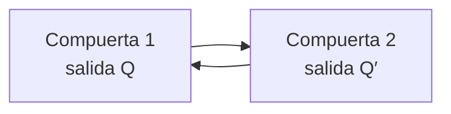

# Flip-flops

## 1. Concepto de flip-flop

Un **flip-flop** es una celda binaria capaz de almacenar un bit de información. Puede mantener uno de sus dos estados mientras el circuito reciba alimentación, hasta que una señal de entrada solicite un cambio.

Los dos estados posibles son:

- **Estado de puesta a cero:** $Q=0$.
- **Estado de puesta a uno:** $Q=1$.

Un flip-flop normalmente dispone de dos salidas:

- $Q$: salida normal.
- $Q'$: salida complementada.

| Estado almacenado |  $Q$  | $Q'$  |
| :---------------: | :---: | :---: |
|         0         |   0   |   1   |
|         1         |   1   |   0   |

En operación normal:

$$
Q'=\overline{Q}
$$

Las dos salidas no representan dos bits distintos. Son dos formas complementarias de observar el mismo bit almacenado.

> [!note]
> Los términos *flip-flop*, *biestable* y *celda binaria* destacan la capacidad del circuito para permanecer en uno de dos estados estables.

## 2. Estado presente y estado siguiente

El valor almacenado antes de aplicar una acción se denomina **estado presente** y se representa por $Q(t)$. El valor que queda después de la acción se denomina **estado siguiente** y se representa por $Q(t+1)$.

$$
Q(t)\longrightarrow Q(t+1)
$$

Para abreviar se utilizan también:

$$
Q\equiv Q(t)
$$

$$
Q^+\equiv Q(t+1)
$$

El estado siguiente depende del tipo de flip-flop, sus entradas y el estado presente.

### 2.1 Acciones fundamentales

| Acción       | Estado siguiente |
| ------------ | :--------------: |
| Conservar    |     $Q^+=Q$      |
| Poner a cero |     $Q^+=0$      |
| Poner a uno  |     $Q^+=1$      |
| Complementar |     $Q^+=Q'$     |

Los distintos tipos de flip-flop proporcionan diferentes maneras de solicitar estas acciones.

## 3. Realimentación y almacenamiento

Un flip-flop básico puede construirse con dos compuertas NAND o con dos compuertas NOR realimentadas de forma cruzada. La salida de cada compuerta se conecta a una entrada de la otra.



La realimentación permite que, después de retirar una señal momentánea de entrada, las salidas continúen sosteniendo el estado establecido.

Los dos valores de salida deben ser coherentes entre sí:

$$
Q=1\Longleftrightarrow Q'=0
$$

$$
Q=0\Longleftrightarrow Q'=1
$$

## 4. Flip-flop básico con compuertas NOR

El circuito básico con NOR utiliza entradas activas en $1$:

- $S$ (*set*): puesta a uno.
- $R$ (*reset*): puesta a cero.

### 4.1 Puesta a uno

Si inicialmente $Q=0$ y se aplica momentáneamente:

$$
S=1,\qquad R=0
$$

la entrada $S$ obliga a que $Q'=0$. Este valor realimentado hace que $Q=1$.

Cuando $S$ vuelve a $0$, ambas entradas quedan en $0$, pero la realimentación conserva:

$$
Q=1,\qquad Q'=0
$$

### 4.2 Puesta a cero

Si se aplica momentáneamente:

$$
S=0,\qquad R=1
$$

la entrada $R$ obliga a que $Q=0$. La realimentación establece:

$$
Q'=1
$$

Después de volver $R$ a $0$, el estado permanece almacenado.

### 4.3 Tabla de operación

|  $S$  |  $R$  |     $Q^+$     | Operación                |
| :---: | :---: | :-----------: | ------------------------ |
|   0   |   0   |      $Q$      | Conservar                |
|   0   |   1   |       0       | Poner a cero             |
|   1   |   0   |       1       | Poner a uno              |
|   1   |   1   | Indeterminado | Combinación no permitida |

Cuando $S=R=1$, ambas salidas de las compuertas NOR valen $0$:

$$
Q=Q'=0
$$

Las salidas dejan de ser complementarias. Si ambas entradas regresan simultáneamente a $0$, el estado final puede depender de los retardos internos, por lo que esta combinación debe evitarse.

> **Ejemplo**
> 
> Considérese la secuencia:
>
>|Paso|$S$|$R$|Estado $Q$|
>|:---:|:---:|:---:|:---:|
>|Inicial|-|-|0|
>|1|1|0|1|
>|2|0|0|1|
>|3|0|1|0|
>|4|0|0|0|
>
> Los pasos 2 y 4 demuestran el almacenamiento: con las mismas entradas $S=R=0$, el circuito conserva estados diferentes según la acción anterior.

## 5. Flip-flop básico con compuertas NAND

El circuito básico con NAND opera con entradas activas en $0$. Para distinguirlas se representan como:

$$
\overline{S},\qquad\overline{R}
$$

- $\overline{S}=0$: orden de puesta a uno.
- $\overline{R}=0$: orden de puesta a cero.
- Ambas entradas en $1$: conservación.

### 5.1 Tabla de operación

| $\overline{S}$ | $\overline{R}$ |     $Q^+$     | Operación                |
| :------------: | :------------: | :-----------: | ------------------------ |
|       1        |       1        |      $Q$      | Conservar                |
|       0        |       1        |       1       | Poner a uno              |
|       1        |       0        |       0       | Poner a cero             |
|       0        |       0        | Indeterminado | Combinación no permitida |

Cuando ambas entradas valen $0$, las salidas NAND valen $1$:

$$
Q=Q'=1
$$

Esta combinación también rompe la relación complementaria entre las salidas.

> **Ejemplo**
> 
> Para almacenar un $1$ se aplica momentáneamente:
>
> $$
> \overline{S}=0,\qquad\overline{R}=1
> $$
>
> Después se devuelve $\overline{S}$ a $1$. Con $\overline{S}=\overline{R}=1$, la realimentación conserva $Q=1$.

### 5.2 Comparación entre los circuitos básicos

| Característica            | NOR            | NAND                          |
| ------------------------- | -------------- | ----------------------------- |
| Entradas de acción        | Activas en $1$ | Activas en $0$                |
| Condición de conservación | $S=R=0$        | $\overline{S}=\overline{R}=1$ |
| Condición no permitida    | $S=R=1$        | $\overline{S}=\overline{R}=0$ |
| Realimentación cruzada    | Sí             | Sí                            |
| Bit almacenado            | $Q$            | $Q$                           |

## 6. Flip-flop RS temporizado

El flip-flop básico es un circuito secuencial asincrónico: sus entradas pueden modificarlo directamente. Para controlar el momento de cambio se agregan compuertas gobernadas por un pulso de reloj $CP$.

El **flip-flop RS temporizado** posee:

- Entrada $S$ de puesta a uno.
- Entrada $R$ de puesta a cero.
- Entrada $CP$ de reloj.
- Salidas $Q$ y $Q'$.

### 6.1 Reloj inactivo

Cuando:

$$
CP=0
$$

las entradas $S$ y $R$ no alcanzan el biestable básico. El estado se conserva independientemente de sus valores:

$$
Q^+=Q
$$

### 6.2 Reloj activo

Cuando:

$$
CP=1
$$

las entradas controlan el estado:

|  $S$  |  $R$  |     $Q^+$     | Operación    |
| :---: | :---: | :-----------: | ------------ |
|   0   |   0   |      $Q$      | Conservar    |
|   0   |   1   |       0       | Poner a cero |
|   1   |   0   |       1       | Poner a uno  |
|   1   |   1   | Indeterminado | No permitida |

> [!note]
> La tabla característica supone que el reloj se encuentra en la condición que permite actuar al flip-flop. Cuando el reloj está inactivo, el estado se conserva.

## 7. Tabla característica

La **tabla característica** especifica el estado siguiente como función de las entradas y del estado presente.

Para el flip-flop RS temporizado:

|  $Q$  |  $S$  |  $R$  | $Q^+$ |
| :---: | :---: | :---: | :---: |
|   0   |   0   |   0   |   0   |
|   0   |   0   |   1   |   0   |
|   0   |   1   |   0   |   1   |
|   0   |   1   |   1   |  $X$  |
|   1   |   0   |   0   |   1   |
|   1   |   0   |   1   |   0   |
|   1   |   1   |   0   |   1   |
|   1   |   1   |   1   |  $X$  |

$X$ indica una condición indeterminada. La tabla combina:

- El estado presente $Q$.
- Las entradas $S$ y $R$.
- El estado siguiente $Q^+$.

> **Ejemplo**
> 
> Si $Q=1$, $S=0$ y $R=0$, la tabla produce:
>
> $$
> Q^+=1
> $$
>
> El flip-flop conserva el estado. Si se mantiene $Q=1$ pero se cambia $R$ a $1$, entonces:
>
> $$
> Q^+=0
> $$

## 8. Ecuación característica del RS

La **ecuación característica** expresa algebraicamente la misma información de la tabla.

Para el RS temporizado:

$$
\boxed{Q^+=S+R'Q}
$$

con la restricción:

$$
\boxed{SR=0}
$$

La restricción excluye $S=R=1$.

### 8.1 Interpretación

- Si $S=1$, entonces $Q^+=1$.
- Si $S=0$ y $R=1$, entonces $Q^+=0$.
- Si $S=0$ y $R=0$, entonces $Q^+=Q$.

> **Ejemplo**
> 
> Para $S=0$, $R=0$ y $Q=1$:
>
> $$
> Q^+=0+(1)(1)=1
> $$
>
> Para $S=0$, $R=1$ y $Q=1$:
>
> $$
> Q^+=0+(0)(1)=0
> $$

## 9. Flip-flop D

El **flip-flop D** es una modificación del RS. Se agrega un inversor para producir dos señales internas complementarias a partir de una sola entrada $D$.

Cuando el reloj permite la operación:

- Si $D=1$, se solicita poner a uno.
- Si $D=0$, se solicita poner a cero.

Las dos entradas internas del RS nunca solicitan simultáneamente puesta a uno y puesta a cero. Así se elimina la combinación indeterminada durante la operación normal.

### 9.1 Tabla característica

|  $Q$  |  $D$  | $Q^+$ |
| :---: | :---: | :---: |
|   0   |   0   |   0   |
|   0   |   1   |   1   |
|   1   |   0   |   0   |
|   1   |   1   |   1   |

El estado presente no altera el resultado. El estado siguiente copia la entrada:

$$
\boxed{Q^+=D}
$$

> **Ejemplo**
> 
> Si antes del pulso $Q=1$ y la entrada es $D=0$, después de la acción:
>
> $$
> Q^+=0
> $$
>
> Si antes del siguiente pulso se coloca $D=1$, el nuevo estado será $1$.

### 9.2 Aplicación conceptual

El flip-flop D almacena el valor presente en su entrada cuando el control temporal permite el cambio. Por ello se utiliza como base de registros y otros sistemas de almacenamiento.

## 10. Flip-flop JK

El **flip-flop JK** refina el comportamiento del RS. Sus entradas $J$ y $K$ actúan como las entradas de puesta a uno y puesta a cero, pero la combinación $J=K=1$ se utiliza para complementar el estado.

|  $J$  |  $K$  | $Q^+$ | Operación    |
| :---: | :---: | :---: | ------------ |
|   0   |   0   |  $Q$  | Conservar    |
|   0   |   1   |   0   | Poner a cero |
|   1   |   0   |   1   | Poner a uno  |
|   1   |   1   | $Q'$  | Complementar |

No existe una combinación indeterminada en la tabla característica del JK.

### 10.1 Tabla característica completa

|  $Q$  |  $J$  |  $K$  | $Q^+$ |
| :---: | :---: | :---: | :---: |
|   0   |   0   |   0   |   0   |
|   0   |   0   |   1   |   0   |
|   0   |   1   |   0   |   1   |
|   0   |   1   |   1   |   1   |
|   1   |   0   |   0   |   1   |
|   1   |   0   |   1   |   0   |
|   1   |   1   |   0   |   1   |
|   1   |   1   |   1   |   0   |

### 10.2 Ecuación característica

$$
\boxed{Q^+=JQ'+K'Q}
$$

El primer término permite poner a uno cuando el estado presente es $0$. El segundo conserva o produce un $1$ cuando $K=0$ y el estado presente es $1$.

> **Ejemplo 1**
> 
> Si $J=K=1$ y $Q=0$:
>
> $$
> Q^+=(1)(1)+(0)(0)=1
> $$
>
> El estado cambia de $0$ a $1$.

> **Ejemplo 2**
> 
> Si $J=K=1$ y $Q=1$:
>
> $$
> Q^+=(1)(0)+(0)(1)=0
> $$
>
> El estado cambia de $1$ a $0$.

### 10.3 Restricción temporal del circuito sencillo

La realización JK presentada en la sección utiliza realimentación desde $Q$ y $Q'$ hacia las compuertas de entrada. Si el pulso de reloj permanece activo durante demasiado tiempo con $J=K=1$, el estado puede cambiar repetidamente.

Para evitarlo, el pulso debe terminar antes de que el nuevo estado vuelva a propagarse por todo el circuito. Las soluciones temporales más completas, como maestro-esclavo y disparo por flanco, pertenecen al tema siguiente.

## 11. Flip-flop T

El **flip-flop T** se obtiene conectando juntas las entradas $J$ y $K$ de un flip-flop JK:

$$
J=K=T
$$

Posee una sola entrada de control:

|  $T$  | $Q^+$ | Operación    |
| :---: | :---: | ------------ |
|   0   |  $Q$  | Conservar    |
|   1   | $Q'$  | Complementar |

### 11.1 Tabla característica completa

|  $Q$  |  $T$  | $Q^+$ |
| :---: | :---: | :---: |
|   0   |   0   |   0   |
|   0   |   1   |   1   |
|   1   |   0   |   1   |
|   1   |   1   |   0   |

### 11.2 Ecuación característica

Al sustituir $J=K=T$ en la ecuación del JK:

$$
Q^+=TQ'+T'Q
$$

Por tanto:

$$
\boxed{Q^+=T\oplus Q}
$$

> **Ejemplo**
> 
> Si $T=1$ y el estado inicial es $Q=0$, cada acción autorizada complementa el estado:
>
>|Pulso|$Q$|
>|:---:|:---:|
>|Inicial|0|
>|1|1|
>|2|0|
>|3|1|
>|4|0|
>
> Esta propiedad permite utilizar el flip-flop T en contadores.

## 12. Comparación de los tipos de flip-flop

| Tipo | Entradas | Conservar     | Poner a cero | Poner a uno | Complementar | Condición no permitida |
| ---- | -------- | ------------- | ------------ | ----------- | ------------ | ---------------------- |
| RS   | $S,R$    | `00`          | `01`         | `10`        | No directa   | `11`                   |
| D    | $D$      | Solo si $D=Q$ | `0`          | `1`         | No directa   | Ninguna                |
| JK   | $J,K$    | `00`          | `01`         | `10`        | `11`         | Ninguna en la tabla    |
| T    | $T$      | `0`           | Según $Q$    | Según $Q$   | `1`          | Ninguna                |

### 12.1 Ecuaciones características

| Tipo | Ecuación característica |
| ---- | ----------------------- |
| RS   | $Q^+=S+R'Q$, con $SR=0$ |
| D    | $Q^+=D$                 |
| JK   | $Q^+=JQ'+K'Q$           |
| T    | $Q^+=T'Q+TQ'=T\oplus Q$ |

Estas ecuaciones permiten incorporar el comportamiento de la memoria al análisis algebraico de un circuito secuencial.

## 13. Cómo elegir el tipo de flip-flop

La elección depende de la operación requerida:

- **RS:** útil para comprender las acciones básicas de puesta a uno y puesta a cero.
- **D:** conveniente cuando se desea almacenar directamente un dato.
- **JK:** ofrece conservación, puesta a cero, puesta a uno y complementación mediante dos entradas.
- **T:** apropiado cuando la acción principal consiste en conservar o alternar el estado.

No existe un tipo universalmente mejor. La selección depende de la función, las entradas disponibles y la facilidad para obtener la lógica de control.

## 14. Procedimientos de resolución

### 14.1 Obtener el estado siguiente

1. Identifique el tipo de flip-flop.
2. Determine el estado presente $Q$.
3. Determine los valores de entrada.
4. Consulte la tabla característica o sustituya en la ecuación.
5. Verifique las restricciones del tipo utilizado.
6. Interprete si la acción conserva, borra, establece o complementa.

### 14.2 Construir una tabla característica

1. Liste todas las combinaciones del estado presente y las entradas.
2. Determine la acción solicitada en cada fila.
3. Escriba el estado siguiente.
4. Marque como $X$ las condiciones indeterminadas.
5. Compruebe que la tabla coincida con la operación física del circuito.

### 14.3 Obtener una ecuación característica

1. Considere la tabla como una función booleana de $Q$ y las entradas.
2. Marque los unos de $Q^+$.
3. Utilice las condiciones indeterminadas como no importa cuando corresponda.
4. Simplifique la función.
5. Escriba por separado cualquier restricción de entrada.
6. Verifique la ecuación contra todas las filas válidas.

### Errores frecuentes

| Error                                                | Corrección                                                      |
| ---------------------------------------------------- | --------------------------------------------------------------- |
| Pensar que $Q$ y $Q'$ almacenan dos bits             | Son salidas complementarias del mismo bit.                      |
| Confundir estado presente y siguiente                | $Q$ es el valor actual; $Q^+$ es el valor después de la acción. |
| Usar las entradas NAND como activas en $1$           | En el biestable NAND básico, las órdenes son activas en $0$.    |
| Aplicar simultáneamente puesta a uno y cero en un RS | La combinación produce un estado indeterminado.                 |
| Suponer que $CP=0$ borra el flip-flop                | El reloj inactivo conserva el estado.                           |
| Olvidar el estado presente al analizar JK o T        | Su operación puede conservar o complementar $Q$.                |
| Confundir $J=K=1$ con la condición inválida del RS   | En el JK, esta combinación complementa el estado.               |
| Creer que $T=1$ siempre produce $Q=1$                | Produce $Q^+=Q'$.                                               |
| Aplicar la ecuación RS sin su restricción            | Debe cumplirse $SR=0$.                                          |
| Adelantar la respuesta por flanco                    | La sección 6-2 todavía no desarrolla los métodos de disparo.    |

# Verificación del aprendizaje

**Problema 1:** resuelva el problema 6-1 del libro. Dibuje el diagrama lógico de un flip-flop RS temporizado utilizando cuatro compuertas NAND y explique su funcionamiento para $CP=0$ y $CP=1$.

**Problema 2:** resuelva el problema 6-4 del libro. Considere un flip-flop $JK'$, es decir, un JK con un inversor entre la entrada externa $K'$ y la entrada interna $K$:

1. Obtenga su tabla característica.
2. Obtenga su ecuación característica.
3. Demuestre que, al conectar juntas las entradas externas, se forma un flip-flop D.

**Problema 3:** resuelva el problema 6-5 del libro. Un flip-flop con dominio de puesta a uno se comporta como un RS, excepto que para $S=R=1$ el resultado es puesta a uno:

1. Obtenga su tabla y ecuación características.
2. Proponga un diagrama lógico asincrónico utilizando un biestable RS con NOR.

> **Soluciones**
>
> **Problema 1**
>
> Dos NAND controlan las entradas y otras dos forman el biestable NAND realimentado:
>
> $$
> \overline{S_L}=(S\cdot CP)'
> $$
>
> $$
> \overline{R_L}=(R\cdot CP)'
> $$
>
> ```mermaid
> flowchart LR
>     S["S"] --> GS["NAND"]
>     CP["CP"] --> GS
>     R["R"] --> GR["NAND"]
>     CP --> GR
>     GS --> L["Biestable NAND<br/>dos NAND realimentadas"]
>     GR --> L
>     L --> Q["Q, Q′"]
> ```
>
> Si $CP=0$, ambas NAND de entrada producen $1$:
>
> $$
> \overline{S_L}=\overline{R_L}=1
> $$
>
> El biestable NAND conserva su estado. Si $CP=1$:
>
> $$
> \overline{S_L}=S',\qquad\overline{R_L}=R'
> $$
>
> Por tanto, $S=1$ pone a uno, $R=1$ pone a cero, `00` conserva y `11` es la combinación no permitida.
>
> **Problema 2**
>
> La entrada externa $K'$ atraviesa un inversor, por lo que la entrada interna es:
>
> $$
> K=(K')'
> $$
>
> La tabla característica es:
>
>|$J$|$K'$|$Q^+$|Operación equivalente en el JK|
>|:---:|:---:|:---:|---|
>|0|0|0|$J=0,K=1$: poner a cero|
>|0|1|$Q$|$J=0,K=0$: conservar|
>|1|0|$Q'$|$J=1,K=1$: complementar|
>|1|1|1|$J=1,K=0$: poner a uno|
>
> Al sustituir $K'$ como entrada externa en la ecuación del JK:
>
> $$
> \boxed{Q^+=JQ'+K'Q}
> $$
>
> Si ambas entradas externas se conectan a una señal $D$:
>
> $$
> J=K'=D
> $$
>
> entonces:
>
> $$
> Q^+=DQ'+DQ=D(Q'+Q)
> $$
>
> $$
> \boxed{Q^+=D}
> $$
>
> Esta es la ecuación característica de un flip-flop D.
>
> **Problema 3**
>
> La tabla característica con dominio de puesta a uno es:
>
>|$S$|$R$|$Q^+$|Operación|
>|:---:|:---:|:---:|---|
>|0|0|$Q$|Conservar|
>|0|1|0|Poner a cero|
>|1|0|1|Poner a uno|
>|1|1|1|Poner a uno por prioridad|
>
> La ecuación que satisface las cuatro filas es:
>
> $$
> \boxed{Q^+=S+R'Q}
> $$
>
> A diferencia del RS convencional, esta ecuación no requiere la restricción $SR=0$, porque la fila `11` se define como puesta a uno.
>
> Para obtener el circuito asincrónico, se utiliza un biestable RS con NOR y se impide la orden de borrado cuando $S=1$:
>
> $$
> S_L=S
> $$
>
> $$
> R_L=RS'
> $$
>
> ```mermaid
> flowchart LR
>     S["S"] --> SL["Entrada S del<br/>biestable NOR"]
>     S --> N["NOT"]
>     R["R"] --> A["AND"]
>     N --> A
>     A --> RL["Entrada R del<br/>biestable NOR"]
>     SL --> L["Biestable RS con NOR"]
>     RL --> L
>     L --> Q["Q, Q′"]
> ```
>
> Si $S=R=1$, se obtiene $S_L=1$ y $R_L=0$, por lo que domina la puesta a uno.

<p align="center">
  <a href="./Tema%201.md">← Tema anterior</a> | <a href="./Tema%203.md">Siguiente tema →</a>
</p>
