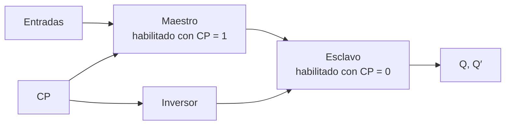

# Diagramas de tiempo

## 1. Representación temporal de señales

Un **diagrama de tiempo** muestra cómo cambian varias señales digitales a medida que avanza el tiempo. Cada señal se representa en una línea horizontal y puede encontrarse en uno de dos niveles:

- Nivel lógico $0$.
- Nivel lógico $1$.

El tiempo avanza de izquierda a derecha. Los segmentos verticales representan transiciones entre niveles.

```text
Tiempo →

X    ____|‾‾‾‾‾‾|________
          0 → 1      1 → 0
```

Al colocar varias señales una debajo de otra, puede determinarse:

- Cuál cambió primero.
- Qué valores existían antes de un pulso.
- Qué transición activó al circuito.
- Cuándo apareció el nuevo estado.
- Si se respetaron las condiciones temporales.

> [!note]
> Una tabla característica explica **qué** estado sigue a determinadas entradas. Un diagrama de tiempo agrega **cuándo** se reconoce la entrada y cuándo aparece ese estado.

## 2. Disparo de un flip-flop

El estado de un flip-flop cambia debido a una variación momentánea de una señal de entrada. Este cambio momentáneo se denomina **disparo** y la transición que lo provoca se dice que dispara al flip-flop.

Un disparo no es solamente un nivel lógico. Es un acontecimiento temporal:

1. Una señal cambia.
2. El flip-flop reconoce el cambio permitido.
3. Las señales se propagan por el circuito.
4. La salida adopta el nuevo estado.

### 2.1 Disparo asincrónico

Los flip-flops asincrónicos básicos responden directamente a un cambio de nivel en sus entradas:

- En el biestable NOR, la entrada activa debe regresar después a $0$.
- En el biestable NAND, la entrada activa debe regresar después a $1$.

El retorno al nivel inactivo permite distinguir una orden momentánea de la siguiente.

### 2.2 Disparo sincrónico

Los flip-flops temporizados reciben pulsos de reloj. Las entradas de datos solo pueden afectar el estado durante el intervalo o la transición para la cual el dispositivo fue diseñado.

El reloj organiza los cambios de numerosos flip-flops alrededor de acontecimientos temporales comunes.

## 3. Pulsos de reloj

Un pulso es una señal que se aparta temporalmente de su nivel inicial y luego regresa a él.

### 3.1 Pulso positivo

Un **pulso positivo** comienza en $0$, sube a $1$ durante un intervalo y vuelve a $0$:

```text
                 ancho del pulso
                 <---------->
CP    __________|‾‾‾‾‾‾‾‾‾‾|__________
                ↑            ↓
          flanco positivo  flanco negativo
```

### 3.2 Pulso negativo

Un **pulso negativo** comienza en $1$, baja a $0$ y vuelve a $1$:

```text
CP    ‾‾‾‾‾‾‾‾‾‾|__________|‾‾‾‾‾‾‾‾‾‾
                ↓          ↑
          flanco negativo  flanco positivo
```

El **ancho del pulso** es el intervalo durante el cual la señal permanece en su nivel temporal.

## 4. Flancos

Un **flanco** es la transición entre dos niveles lógicos.

- **Flanco positivo:** transición de $0$ a $1$.
- **Flanco negativo:** transición de $1$ a $0$.

También se utilizan los nombres:

- Flanco ascendente para $0\rightarrow1$.
- Flanco descendente para $1\rightarrow0$.

| Símbolo conceptual |   Transición    | Nombre          |
| :----------------: | :-------------: | --------------- |
|     $\uparrow$     | $0\rightarrow1$ | Flanco positivo |
|    $\downarrow$    | $1\rightarrow0$ | Flanco negativo |

> **Ejemplo**
> 
> Si un flip-flop D es disparado por flanco positivo, solamente toma en cuenta el valor de $D$ alrededor de cada transición $0\rightarrow1$ del reloj. Los cambios de $D$ ocurridos entre dos flancos positivos no modifican inmediatamente a $Q$.

## 5. Disparo por nivel y disparo por flanco

Un dispositivo sensible al **nivel** puede responder durante todo el intervalo en que el reloj permanece activo. Un dispositivo sensible al **flanco** responde únicamente alrededor de una transición específica.

| Característica         | Por nivel                          | Por flanco                                   |
| ---------------------- | ---------------------------------- | -------------------------------------------- |
| Intervalo de respuesta | Mientras el reloj está activo      | Durante una transición                       |
| Entrada puede influir  | A lo largo del nivel activo        | Alrededor del flanco                         |
| Símbolo de reloj       | Sin indicador dinámico             | Triángulo                                    |
| Riesgo principal       | Cambios múltiples durante el pulso | Violación de establecimiento o sostenimiento |

### 5.1 Transiciones múltiples

En un flip-flop sensible al nivel, una entrada puede provocar un cambio mientras el pulso permanece activo. Si la nueva salida se realimenta o modifica otra entrada antes de terminar el pulso, puede producirse otro cambio dentro del mismo intervalo.

Este fenómeno se denomina **transición múltiple**.

```text
CP   ____|‾‾‾‾‾‾‾‾‾‾|____

Q    ____|‾‾|__|‾‾|_______
          varios cambios
          durante un pulso
```

El estado final puede depender del retardo de propagación y del ancho del pulso, lo que dificulta un comportamiento confiable.

> [!warning]
> Un pulso más largo no siempre es mejor. En una red realimentada puede permitir que el nuevo estado vuelva a las entradas y provoque otra transición antes de que termine el mismo pulso.

## 6. Retardo de propagación y ancho del pulso

Para que un flip-flop sensible al nivel funcione correctamente, las señales deben disponer de tiempo para propagarse y, al mismo tiempo, el pulso no debe permitir realimentaciones no deseadas.

En el circuito JK sencillo estudiado anteriormente, la duración del pulso debe ser menor que el tiempo necesario para que la salida se propague por el lazo y provoque una nueva complementación.

El libro menciona dos métodos generales para limitar el instante efectivo de disparo:

- Generar un pulso muy estrecho mediante una red de resistencia y condensador.
- Utilizar una estructura maestro-esclavo o un flip-flop disparado por flanco.

Las soluciones maestro-esclavo y por flanco permiten una coordinación más clara dentro de sistemas con muchos elementos de memoria.

## 7. Flip-flop maestro-esclavo

Un **flip-flop maestro-esclavo** se construye con dos flip-flops separados:

- El **maestro** recibe las entradas externas.
- El **esclavo** recibe el estado almacenado por el maestro.

Ambos se controlan con niveles opuestos del reloj.



### 7.1 Primera fase: reloj en $1$

Cuando $CP=1$:

- El maestro se habilita.
- Las entradas pueden determinar el estado interno del maestro.
- El esclavo se encuentra aislado.
- La salida externa $Q$ conserva el valor anterior.

### 7.2 Segunda fase: reloj en $0$

Cuando $CP$ vuelve a $0$:

- El maestro queda aislado de las entradas.
- El esclavo se habilita.
- El estado almacenado por el maestro se transfiere a la salida.

Por tanto, el maestro recibe información durante un nivel y el esclavo la publica durante el nivel opuesto.

## 8. Relación temporal maestro-esclavo

Considérese un maestro-esclavo RS con estado inicial $Q=0$. Durante el pulso se aplica una orden de puesta a uno.

```text
Tiempo →

CP   ____|‾‾‾‾‾‾|________
S    ____|‾‾‾‾‾‾|________
Y    ____|‾‾‾‾‾‾‾‾‾‾‾‾‾‾
Q    __________|‾‾‾‾‾‾‾‾
              ↓
       transferencia al esclavo
```

- $Y$ representa el estado del maestro.
- $Q$ representa la salida del esclavo.

El maestro cambia mientras $CP=1$, pero la salida externa cambia cuando el pulso vuelve a $0$.

> **Ejemplo**
> 
> Si $S=1$, $R=0$ y llega un pulso positivo:
>
> 1. En el flanco positivo se habilita el maestro.
> 2. El maestro almacena un $1$.
> 3. Mientras $CP=1$, el esclavo conserva la salida anterior.
> 4. En el flanco negativo, el esclavo recibe el $1$ del maestro.
> 5. La salida $Q$ cambia a $1$.

### 8.1 Cambios de entrada durante el pulso

Si una entrada cambia mientras el maestro permanece habilitado, puede modificar el estado interno antes de que llegue el flanco negativo. El esclavo recibe el último estado válido conservado por el maestro al terminar la fase activa.

Las entradas deben respetar las restricciones del tipo de flip-flop. En un maestro-esclavo RS no debe aplicarse la combinación $S=R=1$.

## 9. Flip-flop JK maestro-esclavo

El flip-flop JK maestro-esclavo combina:

- Un maestro formado por un JK temporizado.
- Un esclavo formado por un RS temporizado.
- Un inversor de reloj entre ambos.

La información presente en $J$ y $K$ se transmite al maestro durante la fase activa. Cuando el reloj cambia al nivel opuesto, el estado del maestro pasa al esclavo.

### 9.1 Complementación controlada

Para $J=K=1$, el JK debe complementar una sola vez por pulso:

$$
Q^+=Q'
$$

El maestro utiliza las salidas anteriores del esclavo para determinar su nuevo estado. El esclavo permanece aislado mientras el maestro cambia, de modo que el nuevo valor externo no vuelve a afectar al maestro durante la misma fase.

> **Ejemplo**
> 
> Con $J=K=1$ y $Q=0$:
>
> - Durante $CP=1$, el maestro cambia internamente a $1$.
> - La salida externa permanece en $0$.
> - Cuando $CP$ vuelve a $0$, el esclavo recibe el estado del maestro.
> - La salida externa cambia una sola vez a $Q=1$.

## 10. Sincronización de varios flip-flops

En un sistema con varios flip-flops maestro-esclavo, todas las entradas de reloj pueden recibir el mismo pulso.

Durante la primera fase:

- Los maestros calculan sus nuevos estados.
- Las salidas externas de los esclavos permanecen sin cambio.

Durante la segunda fase:

- Los maestros quedan aislados.
- Los esclavos publican simultáneamente los estados calculados.

Así, las salidas nuevas no afectan otros maestros hasta el siguiente pulso. Esta separación permite transferir información entre flip-flops conectados en cascada sin que atraviese varias etapas durante un solo pulso.

## 11. Flip-flop disparado por flanco

Un **flip-flop disparado por flanco** sincroniza el cambio de estado durante una transición específica del reloj.

Puede diseñarse para responder a:

- Flanco positivo.
- Flanco negativo.

Una vez que ocurre el flanco correspondiente, las entradas dejan de influir hasta el siguiente flanco activo.

### 11.1 D disparado por flanco positivo

En un flip-flop D de flanco positivo:

$$
Q^+=D
$$

pero la asignación solo ocurre alrededor de la transición:

$$
CP:0\rightarrow1
$$

Los cambios de $D$ mientras el reloj permanece en $0$ o en $1$ no alteran por sí solos a $Q$.

```text
Tiempo →

CP   ____|‾‾‾‾|____|‾‾‾‾|____
          ↑             ↑
D    ____|‾‾‾‾‾‾|_____________
Q    ____|‾‾‾‾‾‾‾‾‾|_________
          copia 1       copia 0
```

> **Ejemplo**
> 
> Si $D=1$ inmediatamente antes del primer flanco positivo, $Q$ cambia a $1$ después del retardo de propagación. Si $D$ cambia a $0$ durante el nivel alto, $Q$ conserva el $1$ hasta el siguiente flanco positivo.

## 12. Operación interna del D de flanco positivo

La construcción del libro utiliza varios biestables NAND conectados de modo que la información se prepara antes del flanco y se transfiere a la salida durante la transición positiva.

### 12.1 Con $CP=0$

Mientras el reloj se encuentra en $0$:

- Las compuertas de salida se mantienen en una condición de conservación.
- La entrada $D$ prepara los valores internos correspondientes.
- La salida $Q$ no cambia.

### 12.2 Durante el flanco positivo

Cuando $CP$ pasa de $0$ a $1$:

- La configuración interna previamente preparada alcanza el biestable de salida.
- $Q$ adopta el valor de $D$ existente antes del flanco.
- Los cambios posteriores de $D$ quedan bloqueados hasta el siguiente flanco activo.

### 12.3 Con $CP=1$

Después de la transición, la realimentación interna mantiene estables las entradas del biestable de salida. Por ello, $D$ puede cambiar sin modificar inmediatamente a $Q$.

## 13. Tiempo de establecimiento

El **tiempo de establecimiento**, $t_{su}$, es el intervalo mínimo durante el cual la entrada debe permanecer estable **antes** del flanco activo.

```text
                 flanco activo
                      ↑
D    ________valor válido________
              <------>
                 t_su
CP   ________________|‾‾‾‾‾‾‾‾
```

La entrada necesita ese tiempo para propagarse hasta la configuración interna que será capturada.

Si $D$ cambia demasiado cerca antes del flanco, el flip-flop puede capturar un valor incorrecto o no alcanzar un estado estable dentro del tiempo esperado.

## 14. Tiempo de sostenimiento

El **tiempo de sostenimiento**, $t_h$, es el intervalo mínimo durante el cual la entrada debe permanecer estable **después** del flanco activo.

```text
            flanco activo
                 ↑
CP   ___________|‾‾‾‾‾‾‾‾
D    ________valor válido________
                 <---->
                   t_h
```

La entrada no debe cambiar hasta que la transición interna se haya completado con seguridad.

### 14.1 Ventana temporal

Los dos tiempos forman una ventana alrededor del flanco:

```text
                    flanco
                      ↑
        establecimiento | sostenimiento
              <---------|--------->
D    __________valor estable____________
CP   ___________________|‾‾‾‾‾‾‾‾‾
```

Durante toda esta ventana, la entrada debe permanecer constante.

> [!warning]
> Que una entrada tenga el valor correcto exactamente en el instante ideal del flanco no es suficiente. Debe permanecer estable durante los intervalos de establecimiento y sostenimiento especificados.

## 15. Retardo entre reloj y salida

Después del flanco activo, la salida no cambia de manera instantánea. Existe un retardo de propagación desde el reloj hasta $Q$, que puede representarse como $t_{CQ}$.

```text
CP   ____|‾‾‾‾‾‾‾‾‾
          ↑
          |<--t_CQ-->| 
Q    ____________|‾‾‾‾
```

Al analizar un diagrama deben distinguirse:

- El instante de captura indicado por el flanco.
- El instante posterior en que la salida se vuelve válida.

## 16. Entradas directas

Algunos flip-flops poseen entradas que permiten forzar el estado sin esperar un pulso de reloj:

- **Puesta a uno directa** o *preset*.
- **Puesta a cero directa** o *clear*.

Estas entradas son **asincrónicas** porque dominan la operación normal y actúan independientemente del reloj.

### 16.1 Inicialización

Al encender un sistema, el estado de los flip-flops puede ser indeterminado. Una entrada directa de borrado permite llevarlos a un estado inicial conocido antes de comenzar la operación temporizada.

Por ejemplo:

$$
\overline{CLR}=0\Longrightarrow Q=0
$$

sin importar el reloj ni las entradas de datos.

### 16.2 Operación normal

Si la entrada directa es activa en bajo, su valor inactivo es $1$:

$$
\overline{CLR}=1
$$

En esta condición no afecta la operación temporizada normal.

> **Ejemplo**
> 
> Un flip-flop JK disparado por flanco negativo posee borrado directo activo en $0$:
>
> - Si $\overline{CLR}=0$, entonces $Q=0$ inmediatamente.
> - Si $\overline{CLR}=1$, el flip-flop responde a $J$ y $K$ en el flanco negativo.
>
> La entrada directa tiene prioridad sobre el reloj.

### 16.3 Tabla de función

| $\overline{CLR}$ |    Reloj     |  $J$  |  $K$  | $Q^+$ | Operación       |
| :--------------: | :----------: | :---: | :---: | :---: | --------------- |
|        0         |     $X$      |  $X$  |  $X$  |   0   | Borrado directo |
|        1         | $\downarrow$ |   0   |   0   |  $Q$  | Conservar       |
|        1         | $\downarrow$ |   0   |   1   |   0   | Poner a cero    |
|        1         | $\downarrow$ |   1   |   0   |   1   | Poner a uno     |
|        1         | $\downarrow$ |   1   |   1   | $Q'$  | Complementar    |

$X$ indica que el valor no importa. Cuando el borrado directo está activo, las demás entradas no influyen.

## 17. Símbolos temporales

Los símbolos gráficos permiten reconocer la forma de disparo:

| Marca en la entrada de reloj | Significado                   |
| ---------------------------- | ----------------------------- |
| Sin triángulo                | Dispositivo sensible al nivel |
| Triángulo sin círculo        | Disparo por flanco positivo   |
| Triángulo con círculo        | Disparo por flanco negativo   |
| Círculo en entrada directa   | Entrada activa en $0$         |

El triángulo es un indicador dinámico: señala que el flip-flop responde a una transición y no a todo el nivel.

## 18. Procedimiento para leer un diagrama de tiempo

1. Identifique el tipo de flip-flop.
2. Determine si responde a un nivel, a un flanco positivo o a un flanco negativo.
3. Localice las entradas directas y compruebe si están activas.
4. Marque cada acontecimiento temporal relevante.
5. Lea las entradas justo antes del flanco correspondiente.
6. Aplique la tabla característica.
7. Desplace el cambio de salida según el retardo de propagación.
8. Conserve $Q$ entre acontecimientos activos.
9. Compruebe establecimiento y sostenimiento.

### 18.1 Prioridad de análisis

Cuando existen entradas directas y reloj, utilice el siguiente orden:

1. Entradas directas activas.
2. Flanco o nivel activo del reloj.
3. Entradas sincrónicas.
4. Conservación del estado.

### 18.2 Ejemplo guiado

Un flip-flop D responde al flanco positivo y comienza con $Q=0$.

| Flanco positivo | Valor estable de $D$ antes del flanco | $Q^+$ |
| :-------------: | :-----------------------------------: | :---: |
|        1        |                   1                   |   1   |
|        2        |                   1                   |   1   |
|        3        |                   0                   |   0   |
|        4        |                   1                   |   1   |

Los cambios intermedios de $D$ que no coinciden con un flanco activo no modifican el estado.

### Errores frecuentes

| Error                                                          | Corrección                                                               |
| -------------------------------------------------------------- | ------------------------------------------------------------------------ |
| Confundir pulso y flanco                                       | El pulso es un intervalo; el flanco es una transición.                   |
| Leer todas las transiciones del reloj como activas             | Identificar la polaridad indicada por el símbolo.                        |
| Cambiar $Q$ cada vez que cambia una entrada                    | En un flip-flop por flanco, solo se captura alrededor del flanco activo. |
| Suponer que maestro y esclavo cambian simultáneamente          | Se habilitan durante fases opuestas del reloj.                           |
| Ignorar cambios de entrada durante el nivel activo del maestro | Pueden alterar el estado que se transferirá al esclavo.                  |
| Suponer que la salida cambia sin demora                        | Considerar el retardo desde reloj hasta salida.                          |
| Cambiar la entrada exactamente junto con el flanco             | Respetar establecimiento y sostenimiento.                                |
| Esperar un reloj para aplicar borrado directo                  | Las entradas directas actúan asincrónicamente.                           |
| Interpretar $X$ como un tercer estado lógico                   | Significa que el valor de esa entrada no importa.                        |
| Activar simultáneamente preset y clear                         | Evitar la combinación no permitida indicada por el dispositivo.          |

# Verificación del aprendizaje

**Problema 1:** resuelva el problema 6-7 del libro. Para el flip-flop JK maestro-esclavo de la figura 6-11, evalúe las salidas de sus nueve compuertas durante la secuencia indicada, comenzando con $CP=0$, $Y=0$, $Q=0$ y $J=K=1$.

**Problema 2:** resuelva el problema 6-8 del libro. Diseñe un flip-flop D maestro-esclavo mostrando una realización completa con compuertas NAND.

**Problema 3:** resuelva el problema 6-9 del libro. En el flip-flop D de flanco positivo de la figura 6-12, conecte una entrada de borrado directo activa en $0$ a las compuertas 2 y 6. Demuestre:

1. Que con borrado igual a $0$, el flip-flop permanece puesto a cero sin importar $CP$ y $D$.
2. Que con borrado igual a $1$, la entrada adicional no afecta la operación normal.

> **Soluciones**
>
> **Problema 1**
>
> Sean $G_1,\ldots,G_9$ las salidas de las compuertas numeradas. En la figura:
>
> $$
> G_1=(J\,CP\,Q')',\qquad G_2=(K\,CP\,Q)'
> $$
>
> $$
> G_3=Y,\qquad G_4=Y',\qquad G_9=CP'
> $$
>
> $$
> G_5=(Y\,CP')',\qquad G_6=(Y'CP')'
> $$
>
> $$
> G_7=Q,\qquad G_8=Q'
> $$
>
> Después de que cada transición se estabiliza, los valores son:
>
>|Paso|Condición|$G_1$|$G_2$|$G_3$|$G_4$|$G_5$|$G_6$|$G_7$|$G_8$|$G_9$|
>|:---:|---|:---:|:---:|:---:|:---:|:---:|:---:|:---:|:---:|:---:|
>|a|$CP=0,J=K=1$|1|1|0|1|1|0|0|1|1|
>|b|$CP\rightarrow1$|0|1|1|0|1|1|0|1|0|
>|c|$CP\rightarrow0$; luego $J=0$|1|1|1|0|0|1|1|0|1|
>|d|$CP\rightarrow1$|1|0|0|1|1|1|1|0|0|
>|e|$CP\rightarrow0$; luego $K=0$|1|1|0|1|1|0|0|1|1|
>
> En el paso b, el maestro cambia a $Y=1$, pero el esclavo conserva $Q=0$. En el paso c, el nuevo estado pasa al esclavo y $Q=1$. El segundo pulso prepara $Y=0$ en el paso d y lo transfiere a $Q$ en el paso e.
>
> Después del paso e se tiene $J=K=0$. Los pulsos siguientes conservan $Y=0$ y $Q=0$, por lo que no producen cambios adicionales.
>
> **Problema 2**
>
> Se utilizan dos biestables D con NAND habilitados durante niveles opuestos.
>
> Para el maestro:
>
> $$
> D'=(DD)'
> $$
>
> $$
> N_1=(D\,CP)',\qquad N_2=(D'CP)'
> $$
>
> $$
> Y=(N_1Y')',\qquad Y'=(N_2Y)'
> $$
>
> El reloj complementado para el esclavo se obtiene mediante otra NAND usada como inversor:
>
> $$
> CP'=(CP\,CP)'
> $$
>
> Para el esclavo:
>
> $$
> N_3=(Y\,CP')',\qquad N_4=(Y'CP')'
> $$
>
> $$
> Q=(N_3Q')',\qquad Q'=(N_4Q)'
> $$
>
> ```mermaid
> flowchart LR
>     D["D"] --> IM["Inversor NAND"]
>     D --> GM["Dos NAND de entrada<br/>habilitadas por CP"]
>     IM --> GM
>     CP["CP"] --> GM
>     GM --> M["Dos NAND realimentadas<br/>maestro: Y, Y′"]
>     M --> GS["Dos NAND de entrada<br/>habilitadas por CP′"]
>     CP --> IC["Inversor NAND<br/>CP′"]
>     IC --> GS
>     GS --> S["Dos NAND realimentadas<br/>esclavo: Q, Q′"]
> ```
>
> Con $CP=1$, el maestro acepta $D$ y el esclavo conserva $Q$. Con $CP=0$, el maestro se aísla y el esclavo copia $Y$. Por tanto, la salida externa cambia durante la transición de $1$ a $0$ del reloj.
>
> **Problema 3**
>
> Sea $\overline{CLR}$ la entrada agregada a una entrada de las NAND 2 y 6.
>
> Si:
>
> $$
> \overline{CLR}=0
> $$
>
> una NAND que recibe ese cero produce $1$ independientemente de sus demás entradas. Por tanto:
>
> $$
> G_2=1,\qquad Q'=G_6=1
> $$
>
> La realimentación obliga a la compuerta 5 a producir:
>
> $$
> \boxed{Q=0}
> $$
>
> El cero directo domina cualquier valor de $CP$ y $D$, por lo que el estado permanece borrado.
>
> Si:
>
> $$
> \overline{CLR}=1
> $$
>
> el nuevo factor es neutro en el producto de entrada de cada NAND:
>
> $$
> (1\cdot X)'=X'
> $$
>
> Las compuertas 2 y 6 recuperan exactamente sus funciones originales. Por ello, el flip-flop vuelve a responder normalmente a $D$ durante los flancos positivos de $CP$.

<p align="center">
  <a href="./Tema%202.md">← Tema anterior</a> | <a href="./Tema%204.md">Siguiente tema →</a>
</p>
