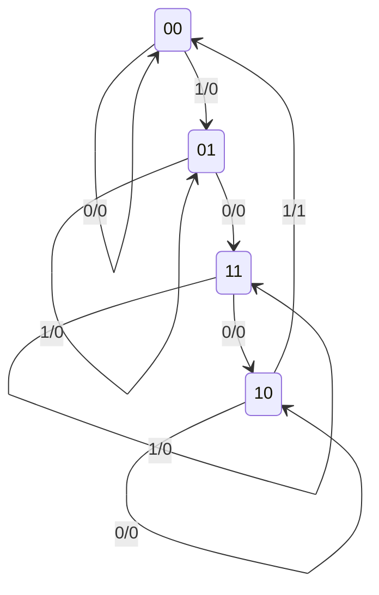

# Diagramas de estado

## 1. Análisis de circuitos secuenciales temporizados

El **análisis de un circuito secuencial** consiste en determinar su comportamiento a partir del diagrama lógico que lo implementa. El resultado puede expresarse mediante:

- Una tabla de estado.
- Un diagrama de estado.
- Ecuaciones de estado y de salida.
- Una secuencia temporal de entradas, estados y salidas.

En un circuito combinacional, las salidas dependen únicamente de las entradas actuales. En un circuito secuencial, también interviene el **estado presente**, almacenado por los flip-flops:

$$
\text{estado siguiente}=f(\text{estado presente},\text{entradas})
$$

$$
\text{salida}=g(\text{estado presente},\text{entradas})
$$

> [!note]
> El análisis parte de un circuito existente y descubre qué hace. El diseño realiza el recorrido inverso: parte del comportamiento deseado y obtiene el circuito. Ese proceso se estudiará en el tema siguiente.

## 2. Estado presente y estado siguiente

El **estado presente** es el conjunto de valores almacenados en los flip-flops antes del pulso activo del reloj. El **estado siguiente** es el conjunto de valores que almacenarán después de ese pulso.

Si el circuito posee dos flip-flops llamados $A$ y $B$, su estado puede escribirse como el número binario $AB$:

|  $A$  |  $B$  | Estado |
| :---: | :---: | :----: |
|   0   |   0   |  $00$  |
|   0   |   1   |  $01$  |
|   1   |   0   |  $10$  |
|   1   |   1   |  $11$  |

Con $n$ flip-flops pueden existir hasta:

$$
2^n
$$

estados binarios diferentes.

La notación temporal permite distinguir ambos instantes:

- $A(t)$: valor presente del flip-flop $A$.
- $A(t+1)$: valor de $A$ después del siguiente pulso.
- $A^+$: abreviatura frecuente de $A(t+1)$.

## 3. Tabla de estado

Una **tabla de estado** enumera el estado siguiente y la salida para cada combinación posible de estado presente y entradas.

Su estructura general es:

| Estado presente                    |     Entrada      | Estado siguiente          |                   Salida                   |
| ---------------------------------- | :--------------: | ------------------------- | :----------------------------------------: |
| Valores actuales de los flip-flops | Valores externos | Valores después del reloj | Valor producido durante el estado presente |

Si existen $n$ flip-flops y $m$ entradas binarias, deben evaluarse:

$$
2^n\cdot2^m=2^{n+m}
$$

combinaciones.

### 3.1 Cómo obtener una fila

Para una combinación concreta:

1. Fije el estado presente.
2. Fije los valores de las entradas externas.
3. Evalúe la lógica conectada a las entradas de cada flip-flop.
4. Aplique la tabla o ecuación característica del tipo de flip-flop.
5. Escriba conjuntamente los nuevos valores como estado siguiente.
6. Evalúe las funciones de salida con los valores presentes.

> [!warning]
> El estado siguiente se calcula para **todos** los flip-flops usando el mismo estado presente. No debe actualizarse un flip-flop y emplear inmediatamente ese valor nuevo para calcular otro.

## 4. Ejemplo del libro: circuito con dos flip-flops RS

El circuito analizado por el libro posee:

- Una entrada externa $x$.
- Dos flip-flops RS temporizados, $A$ y $B$.
- Una salida externa $y$.
- Disparo común por flanco negativo.

Sus funciones de entrada y salida son:

$$
S_A=Bx',\qquad R_A=B'x
$$

$$
S_B=A'x,\qquad R_B=Ax'
$$

$$
y=AB'x
$$

Cada pareja $S,R$ determina el siguiente valor del flip-flop correspondiente.

### 4.1 Obtención de una transición

> **Ejemplo**
> 
> Considérese el estado presente $AB=00$ y la entrada $x=1$.
>
> Para el flip-flop $A$:
>
> $$
> S_A=Bx'=0(0)=0
> $$
>
> $$
> R_A=B'x=1(1)=1
> $$
>
> Por tanto, $A$ se pone a cero.
>
> Para el flip-flop $B$:
>
> $$
> S_B=A'x=1(1)=1
> $$
>
> $$
> R_B=Ax'=0(0)=0
> $$
>
> Por tanto, $B$ se pone a uno. El estado siguiente es:
>
> $$
> AB:00\longrightarrow01
> $$
>
> La salida durante el estado presente vale:
>
> $$
> y=AB'x=0(1)(1)=0
> $$

### 4.2 Tabla de estado completa

Repitiendo el procedimiento para las ocho combinaciones se obtiene la tabla presentada en el libro:

| Estado presente $AB$ | Estado siguiente con $x=0$ | Estado siguiente con $x=1$ | $y$ con $x=0$ | $y$ con $x=1$ |
| :------------------: | :------------------------: | :------------------------: | :-----------: | :-----------: |
|          00          |             00             |             01             |       0       |       0       |
|          01          |             11             |             01             |       0       |       0       |
|          10          |             10             |             00             |       0       |       1       |
|          11          |             10             |             11             |       0       |       0       |

La salida solo vale $1$ cuando se cumple simultáneamente:

$$
A=1,\qquad B=0,\qquad x=1
$$

porque $y=AB'x$.

> [!note]
> El estado inicial no siempre queda determinado por el circuito. En aplicaciones prácticas suele definirse mediante entradas directas de puesta a cero o puesta a uno. Si no se especifica un estado inicial, el análisis puede comenzar desde cualquier estado posible.

## 5. Diagrama de estado

Un **diagrama de estado** representa gráficamente la misma información de una tabla de estado:

- Cada círculo representa un estado.
- Cada flecha representa una transición.
- Un lazo indica que el estado no cambia.
- La dirección de la flecha indica el estado siguiente.

En el ejemplo, cada transición se rotula como:

$$
\frac{\text{entrada}}{\text{salida}}
$$

Así, la etiqueta $1/0$ significa que, con entrada $x=1$, la salida presente es $y=0$ y el circuito sigue la flecha indicada después del pulso.



### 5.1 Lectura de una secuencia

> **Ejemplo**
> 
> Si el estado inicial es $00$ y la secuencia de entrada es:
>
> $$
> x=1,0,1,1
> $$
>
> el recorrido se obtiene siguiendo una flecha por cada pulso:
>
> $$
> 00\xrightarrow{1/0}01\xrightarrow{0/0}11\xrightarrow{1/0}11\xrightarrow{1/0}11
> $$
>
> La secuencia de salida es:
>
> $$
> y=0,0,0,0
> $$

### 5.2 Tabla y diagrama contienen la misma información

No existe diferencia funcional entre ambas representaciones:

| Representación     | Ventaja principal                                           |
| ------------------ | ----------------------------------------------------------- |
| Tabla de estado    | Facilita enumerar sistemáticamente todas las combinaciones. |
| Diagrama de estado | Facilita observar recorridos, ciclos y transiciones.        |

La tabla suele ser más fácil de deducir desde el circuito; el diagrama suele ser más fácil de interpretar visualmente.

## 6. Ecuaciones de estado

Una **ecuación de estado** es una expresión de Boole que especifica cuándo el siguiente estado de un flip-flop será $1$.

Su forma general es:

$$
Q(t+1)=f(Q_1,Q_2,\ldots,x_1,x_2,\ldots)
$$

Se parece a una ecuación característica, pero cumple una función distinta:

- La ecuación característica describe de forma general un tipo de flip-flop.
- La ecuación de estado describe un flip-flop específico dentro de un circuito concreto.

### 6.1 Obtención desde la tabla de estado

Para obtener $A(t+1)$ se seleccionan todas las combinaciones de estado presente y entrada en las que el siguiente valor de $A$ es $1$. En el ejemplo, la forma canónica es:

$$
A(t+1)=(A'B+AB'+AB)x'+ABx
$$

El libro también la expresa, después de simplificar, como:

$$
\boxed{A(t+1)=Bx'+(B+x')A}
$$

De manera semejante:

$$
\boxed{B(t+1)=A'x+(A'+x)B}
$$

### 6.2 Obtención desde el diagrama lógico

La ecuación característica de un flip-flop RS es:

$$
Q(t+1)=S+R'Q
$$

Para el flip-flop $A$ se sustituyen sus funciones de entrada:

$$
A(t+1)=S_A+R_A'A
$$

$$
A(t+1)=Bx'+(B'x)'A
$$

Aplicando De Morgan:

$$
(B'x)'=B+x'
$$

por lo que:

$$
\boxed{A(t+1)=Bx'+(B+x')A}
$$

> **Ejemplo**
> 
> Para $A=0$, $B=1$ y $x=0$:
>
> $$
> A(t+1)=1(1)+(1+1)0=1
> $$
>
> $$
> B(t+1)=1(0)+(1+0)1=1
> $$
>
> Por ello, la transición correspondiente es $01\rightarrow11$, exactamente como indica la tabla.

## 7. Funciones de entrada de los flip-flops

Las expresiones conectadas a las entradas de los flip-flops reciben el nombre de **funciones de entrada** o **ecuaciones de entrada**.

Se utiliza una notación de dos letras:

- La primera identifica la entrada del flip-flop.
- La segunda identifica el flip-flop al que pertenece.

Por ejemplo:

$$
J_A=BC'x+B'Cx'
$$

$$
K_A=B+y
$$

$J_A$ es la función conectada a la entrada $J$ del flip-flop $A$ y $K_A$ es la función conectada a su entrada $K$.

En un circuito con flip-flops RS pueden aparecer $S_A$, $R_A$, $S_B$ y $R_B$; con flip-flops JK pueden aparecer $J_A$, $K_A$, $J_B$ y $K_B$.

Las funciones de entrada, las funciones de salida y el tipo de flip-flop especifican algebraicamente el circuito secuencial, aunque no dibujen explícitamente el reloj ni las compuertas.

## 8. Procedimiento de análisis

### 8.1 Desde un diagrama lógico

1. Identifique los flip-flops, las variables de estado, las entradas y las salidas.
2. Determine el tipo y la condición de disparo de cada flip-flop.
3. Escriba las funciones de entrada de todos los flip-flops.
4. Escriba las funciones de salida del circuito.
5. Sustituya las funciones de entrada en las ecuaciones características.
6. Obtenga y simplifique las ecuaciones de estado.
7. Enumere todos los estados presentes y combinaciones de entrada.
8. Calcule el estado siguiente y la salida para cada caso.
9. Construya la tabla de estado.
10. Dibuje el diagrama de estado y compruebe que reproduce la tabla.

### 8.2 Desde ecuaciones

Si las ecuaciones de estado ya fueron proporcionadas, puede comenzarse en el paso 7. Evalúe siempre todas las ecuaciones con los mismos valores presentes antes de avanzar al siguiente pulso.

### Errores frecuentes

| Error                                                     | Corrección                                                                         |
| --------------------------------------------------------- | ---------------------------------------------------------------------------------- |
| Confundir estado presente y estado siguiente              | Use $Q$ para el valor actual y $Q^+$ o $Q(t+1)$ para el posterior al pulso.        |
| Omitir combinaciones de entrada                           | Una tabla completa incluye $2^{n+m}$ evaluaciones.                                 |
| Actualizar los flip-flops uno por uno                     | Calcule todas las variables siguientes desde un único estado presente.             |
| Usar el estado siguiente para calcular la salida presente | Evalúe la función de salida con las variables indicadas por su ecuación.           |
| Invertir el orden de bits                                 | Declare el orden, por ejemplo $AB$, y consérvelo en toda la nota.                  |
| Interpretar $1/0$ como dos entradas                       | En una flecha significa entrada $1$ y salida $0$.                                  |
| Olvidar los lazos                                         | Si estado presente y siguiente coinciden, dibuje una flecha hacia el mismo estado. |
| Asignar una salida distinta a tabla y diagrama            | Cada flecha debe copiar exactamente la entrada y la salida de su fila.             |
| Ignorar una entrada prohibida de un flip-flop RS          | Compruebe que no ocurra $S=R=1$.                                                   |

# Verificación del aprendizaje

**Problema 1:** resuelva el problema 6-10 del libro. Un sumador completo recibe las entradas externas $x$ y $y$, mientras que la tercera entrada $z$ proviene de la salida de un flip-flop D. El acarreo $C$ se almacena en el flip-flop en cada pulso y la salida externa $S$ es la suma de $x$, $y$ y $z$. Obtenga la tabla y el diagrama de estado.

**Problema 2:** resuelva el problema 6-12 del libro. El circuito tiene cuatro flip-flops $A$, $B$, $C$ y $D$, una entrada $x$ y las ecuaciones:

$$
A(t+1)=(CD'+C'D)x+(CD+C'D')x'
$$

$$
B(t+1)=A,\qquad C(t+1)=B,\qquad D(t+1)=C
$$

Encuentre:

1. La secuencia de estados para $x=1$, comenzando en $ABCD=0001$.
2. La secuencia de estados para $x=0$, comenzando en $ABCD=0000$.

> **Soluciones**
>
> **Problema 1**
>
> Para el sumador completo:
>
> $$
> S=x\oplus y\oplus z
> $$
>
> $$
> C=xy+xz+yz
> $$
>
> Como el acarreo alimenta la entrada D del flip-flop:
>
> $$
> z(t+1)=C
> $$
>
> La tabla de estado es:
>
>|Estado presente $z$|Entrada $xy$|Estado siguiente $z^+$|Salida $S$|
>|:---:|:---:|:---:|:---:|
>|0|00|0|0|
>|0|01|0|1|
>|0|10|0|1|
>|0|11|1|0|
>|1|00|0|1|
>|1|01|1|0|
>|1|10|1|0|
>|1|11|1|1|
>
> Su diagrama de estado es:
>
> ```mermaid
> stateDiagram-v2
>     state "z = 0" as Z0
>     state "z = 1" as Z1
>
>     Z0 --> Z0: 00/0, 01/1, 10/1
>     Z0 --> Z1: 11/0
>     Z1 --> Z0: 00/1
>     Z1 --> Z1: 01/0, 10/0, 11/1
> ```
>
> Cada etiqueta tiene la forma $xy/S$. El circuito conserva entre operaciones el acarreo producido por la suma anterior, por lo que permite sumar sucesivamente pares de bits.
>
> **Problema 2**
>
> Cuando $x=1$:
>
> $$
> A(t+1)=CD'+C'D=C\oplus D
> $$
>
> Los demás bits se desplazan una posición. La secuencia, hasta regresar al estado inicial, es:
>
> $$
> \begin{aligned}
> 0001&\rightarrow1000\rightarrow0100\rightarrow0010\rightarrow1001\\
> &\rightarrow1100\rightarrow0110\rightarrow1011\rightarrow0101\\
> &\rightarrow1010\rightarrow1101\rightarrow1110\rightarrow1111\\
> &\rightarrow0111\rightarrow0011\rightarrow0001
> \end{aligned}
> $$
>
> Cuando $x=0$:
>
> $$
> A(t+1)=CD+C'D'=(C\oplus D)'
> $$
>
> La secuencia es:
>
> $$
> \begin{aligned}
> 0000&\rightarrow1000\rightarrow1100\rightarrow1110\rightarrow0111\\
> &\rightarrow1011\rightarrow1101\rightarrow0110\rightarrow0011\\
> &\rightarrow1001\rightarrow0100\rightarrow1010\rightarrow0101\\
> &\rightarrow0010\rightarrow0001\rightarrow0000
> \end{aligned}
> $$
>
> En cada paso se evaluó primero $A^+$ con los valores presentes de $C$ y $D$; después se formó simultáneamente el nuevo estado $A^+B^+C^+D^+$.

<p align="center">
  <a href="./Tema%203.md">← Tema anterior</a> | <a href="./Tema%205.md">Siguiente tema →</a>
</p>
