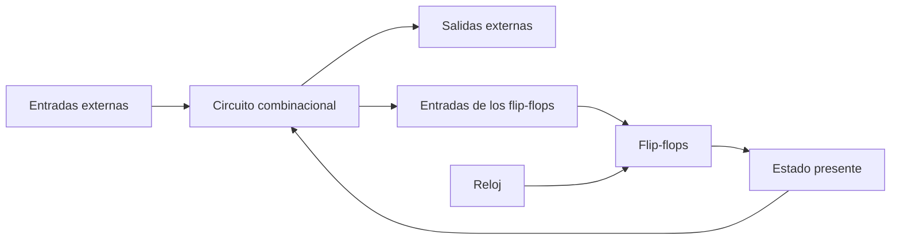
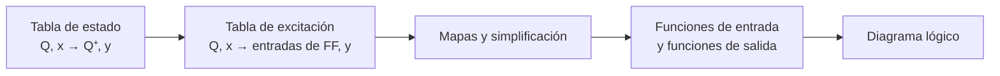

# Diseño con lógica secuencial

## 1. Del análisis al diseño

El **análisis** comienza con un circuito secuencial existente y permite descubrir su comportamiento:

$$
\text{diagrama lógico}\longrightarrow\text{tabla o diagrama de estado}
$$

El **diseño** recorre el camino contrario. Comienza con una especificación y termina con el circuito que debe cumplirla:

$$
\text{especificaciones}
\longrightarrow\text{tabla o diagrama de estado}
\longrightarrow\text{funciones de Boole}
\longrightarrow\text{diagrama lógico}
$$

Un circuito secuencial temporizado se forma con:

- Flip-flops, que almacenan el estado.
- Un circuito combinacional, que calcula el estado siguiente y las salidas.
- Una señal de reloj, que coordina el cambio de estado.

Una vez elegidos el número y el tipo de flip-flops, el problema secuencial se transforma en el diseño de la parte combinacional que alimentará sus entradas.

## 2. Reducción de estados

La **reducción de estados** busca disminuir el número de estados de una tabla sin alterar las relaciones externas entre entradas y salidas.

Dos circuitos son equivalentes desde el punto de vista de entrada-salida si producen la misma secuencia de salida para toda secuencia de entrada aplicada desde estados iniciales correspondientes.

### 2.1 Estados equivalentes

Dos estados son equivalentes si, para cada combinación de entrada:

1. Producen exactamente la misma salida.
2. Conducen al mismo estado o a estados que también son equivalentes.

Cuando se demuestra la equivalencia, uno de los estados puede eliminarse y todas sus apariciones se sustituyen por el estado conservado.

> [!warning]
> Que dos estados tengan las mismas salidas no basta. Sus estados siguientes también deben ser iguales o equivalentes para cada entrada.

### 2.2 Ejemplo de reducción del libro

El libro parte de la siguiente tabla de siete estados:

| Estado presente | Siguiente con $x=0$ | Siguiente con $x=1$ | Salida con $x=0$ | Salida con $x=1$ |
| :-------------: | :-----------------: | :-----------------: | :--------------: | :--------------: |
|       $a$       |         $a$         |         $b$         |        0         |        0         |
|       $b$       |         $c$         |         $d$         |        0         |        0         |
|       $c$       |         $a$         |         $d$         |        0         |        0         |
|       $d$       |         $e$         |         $f$         |        0         |        1         |
|       $e$       |         $a$         |         $f$         |        0         |        1         |
|       $f$       |         $g$         |         $f$         |        0         |        1         |
|       $g$       |         $a$         |         $f$         |        0         |        1         |

Los estados $e$ y $g$ tienen las mismas salidas y, para ambas entradas, conducen a los mismos estados:

$$
e\equiv g
$$

Se elimina $g$ y se sustituye por $e$. La fila de $f$ pasa entonces a conducir a $e$ con $x=0$ y a $f$ con $x=1$.

Ahora $d$ y $f$ tienen las mismas salidas y los mismos estados siguientes, por lo que:

$$
d\equiv f
$$

Al eliminar $f$ y sustituirlo por $d$, se obtiene la tabla reducida:

| Estado presente | Siguiente con $x=0$ | Siguiente con $x=1$ | Salida con $x=0$ | Salida con $x=1$ |
| :-------------: | :-----------------: | :-----------------: | :--------------: | :--------------: |
|       $a$       |         $a$         |         $b$         |        0         |        0         |
|       $b$       |         $c$         |         $d$         |        0         |        0         |
|       $c$       |         $a$         |         $d$         |        0         |        0         |
|       $d$       |         $e$         |         $d$         |        0         |        1         |
|       $e$       |         $a$         |         $d$         |        0         |        1         |

La reducción conserva el comportamiento externo, aunque la secuencia de nombres internos pueda cambiar.

### 2.3 Efecto sobre el circuito

El número mínimo de flip-flops necesario para representar $N$ estados es:

$$
m=\left\lceil\log_2N\right\rceil
$$

En el ejemplo:

$$
\left\lceil\log_2 7\right\rceil=3,
\qquad
\left\lceil\log_2 5\right\rceil=3
$$

Reducir de siete a cinco estados no reduce el número de flip-flops. Sin embargo, deja más combinaciones binarias sin usar, las cuales pueden facilitar la simplificación de la lógica combinacional.

> [!note]
> Menos estados no garantiza automáticamente menos compuertas. La reducción debe evaluarse junto con la asignación binaria y la simplificación de las funciones.

## 3. Asignación de estados

La **asignación de estados** consiste en asociar un código binario diferente con cada estado simbólico.

Para los cinco estados de la tabla reducida, una asignación posible es:

| Estado simbólico | Código $ABC$ |
| :--------------: | :----------: |
|       $a$        |     001      |
|       $b$        |     010      |
|       $c$        |     011      |
|       $d$        |     100      |
|       $e$        |     101      |

La tabla binaria correspondiente es:

| Estado presente $ABC$ | Siguiente con $x=0$ | Siguiente con $x=1$ | Salida con $x=0$ | Salida con $x=1$ |
| :-------------------: | :-----------------: | :-----------------: | :--------------: | :--------------: |
|          001          |         001         |         010         |        0         |        0         |
|          010          |         011         |         100         |        0         |        0         |
|          011          |         001         |         100         |        0         |        0         |
|          100          |         101         |         100         |        0         |        1         |
|          101          |         001         |         100         |        0         |        1         |

Los códigos 000, 110 y 111 quedan sin usar.

### 3.1 Por qué importa la asignación

Diferentes asignaciones representan el mismo comportamiento externo, pero producen funciones de entrada distintas para los flip-flops. Una selección adecuada puede simplificar las compuertas necesarias.

No existe una regla sencilla que garantice siempre la asignación de costo mínimo. En un diseño pequeño pueden compararse varias alternativas; en diseños mayores suelen utilizarse métodos sistemáticos o herramientas de síntesis.

### 3.2 Cuándo no puede cambiarse libremente

Si las salidas se toman directamente de los flip-flops y sus valores binarios forman parte de la especificación, los estados no son meros nombres internos.

En un contador binario, por ejemplo, la secuencia visible debe ser:

$$
000,001,010,011,100,101,110,111
$$

Una asignación arbitraria modificaría la cuenta observada.

## 4. Tabla característica y tabla de excitación

Las dos tablas responden preguntas opuestas:

| Tabla          | Información conocida               | Información buscada | Uso principal |
| -------------- | ---------------------------------- | ------------------- | ------------- |
| Característica | Entradas y estado presente         | Estado siguiente    | Análisis      |
| Excitación     | Estado presente y estado siguiente | Entradas necesarias | Diseño        |

En el diseño se conoce la transición deseada $Q(t)\rightarrow Q(t+1)$ y debe determinarse qué valores aplicar al flip-flop.

## 5. Tablas de excitación

$X$ representa una condición de **no importa**: puede elegirse $0$ o $1$ según convenga para simplificar la función.

| $Q(t)$ | $Q(t+1)$ |  $S$  |  $R$  |  $J$  |  $K$  |  $D$  |  $T$  |
| :----: | :------: | :---: | :---: | :---: | :---: | :---: | :---: |
|   0    |    0     |   0   |  $X$  |   0   |  $X$  |   0   |   0   |
|   0    |    1     |   1   |   0   |   1   |  $X$  |   1   |   1   |
|   1    |    0     |   0   |   1   |  $X$  |   1   |   0   |   1   |
|   1    |    1     |  $X$  |   0   |  $X$  |   0   |   1   |   0   |

### 5.1 Interpretación por tipo

- **RS:** se activa $S$ para subir a $1$ y $R$ para bajar a $0$; se evita $S=R=1$.
- **JK:** $J$ controla la transición desde $0$ y $K$ la transición desde $1$.
- **D:** la entrada es directamente el estado siguiente, $D=Q(t+1)$.
- **T:** vale $0$ para conservar y $1$ para complementar.

> **Ejemplo**
> 
> Un flip-flop debe pasar de $Q=1$ a $Q^+=0$.
>
> - Con RS: $S=0$ y $R=1$.
> - Con JK: $J=X$ y $K=1$.
> - Con D: $D=0$.
> - Con T: $T=1$.
>
> Todos producen la misma transición, pero las funciones combinacionales requeridas pueden ser diferentes.

## 6. Procedimiento general de diseño

El libro organiza el diseño en nueve pasos:

1. Describir con palabras el comportamiento requerido; puede incluir un diagrama de estado, un diagrama de tiempo u otra información.
2. Obtener la tabla de estado.
3. Reducir el número de estados cuando el comportamiento externo lo permita.
4. Asignar códigos binarios si los estados están representados por letras.
5. Determinar el número de flip-flops y nombrar sus variables.
6. Escoger el tipo de flip-flop.
7. Deducir la tabla de excitación del circuito y la tabla de salida.
8. Simplificar las funciones de entrada de los flip-flops y las funciones de salida.
9. Dibujar el diagrama lógico.

### 6.1 Relación entre las tablas

La tabla de estado indica las transiciones requeridas. La tabla de excitación convierte cada una en los valores que debe generar el circuito combinacional:

## 7. Ejemplo del libro: diseño con flip-flops JK

Considérese el circuito especificado por la siguiente tabla de estado. Tiene dos variables de estado, $A$ y $B$, una entrada $x$ y ninguna salida externa adicional.

| Estado presente $AB$ | Siguiente con $x=0$ | Siguiente con $x=1$ |
| :------------------: | :-----------------: | :-----------------: |
|          00          |         00          |         01          |
|          01          |         10          |         01          |
|          10          |         10          |         11          |
|          11          |         11          |         00          |

Como existen cuatro estados, se necesitan dos flip-flops:

$$
m=\log_2 4=2
$$

### 7.1 Conversión de una fila

> **Ejemplo**
> 
> Para $AB=01$ y $x=0$, el estado siguiente es $10$.
>
> El flip-flop $A$ realiza la transición:
>
> $$
> A:0\rightarrow1
> $$
>
> por lo que la tabla JK exige:
>
> $$
> J_A=1,\qquad K_A=X
> $$
>
> El flip-flop $B$ realiza:
>
> $$
> B:1\rightarrow0
> $$
>
> y requiere:
>
> $$
> J_B=X,\qquad K_B=1
> $$

### 7.2 Tabla de excitación completa

|  $A$  |  $B$  |  $x$  | $A^+$ | $B^+$ | $J_A$ | $K_A$ | $J_B$ | $K_B$ |
| :---: | :---: | :---: | :---: | :---: | :---: | :---: | :---: | :---: |
|   0   |   0   |   0   |   0   |   0   |   0   |  $X$  |   0   |  $X$  |
|   0   |   0   |   1   |   0   |   1   |   0   |  $X$  |   1   |  $X$  |
|   0   |   1   |   0   |   1   |   0   |   1   |  $X$  |  $X$  |   1   |
|   0   |   1   |   1   |   0   |   1   |   0   |  $X$  |  $X$  |   0   |
|   1   |   0   |   0   |   1   |   0   |  $X$  |   0   |   0   |  $X$  |
|   1   |   0   |   1   |   1   |   1   |  $X$  |   0   |   1   |  $X$  |
|   1   |   1   |   0   |   1   |   1   |  $X$  |   0   |  $X$  |   0   |
|   1   |   1   |   1   |   0   |   0   |  $X$  |   1   |  $X$  |   1   |

### 7.3 Funciones simplificadas

Al transferir cada columna de excitación a un mapa de Karnaugh y utilizar las $X$ como no importa, el libro obtiene:

$$
\boxed{J_A=Bx'}
$$

$$
\boxed{K_A=Bx}
$$

$$
\boxed{J_B=x}
$$

$$
\boxed{K_B=A\odot x=Ax+A'x'}
$$

donde $\odot$ representa equivalencia o XNOR.

### 7.4 Estructura lógica

El circuito final utiliza:

- Dos flip-flops JK con reloj común.
- Un inversor para obtener $x'$.
- Una AND para $Bx'$.
- Una AND para $Bx$.
- Una compuerta de equivalencia para $A\odot x$.
- Una conexión directa de $x$ hacia $J_B$.

> [!note]
> Las salidas $A$ y $B$ de los flip-flops realimentan el circuito combinacional. Sus valores presentes, junto con $x$, producen las excitaciones que serán capturadas en el siguiente pulso.

## 8. Estados no usados

Si se utilizan $m$ flip-flops, existen $2^m$ códigos binarios. Cuando el diseño necesita menos estados, algunos códigos no aparecen en la especificación.

Durante la simplificación, las combinaciones formadas por estados no usados pueden tratarse como no importa. Esto suele reducir la cantidad de compuertas, pero obliga a revisar qué ocurrirá si el circuito entra accidentalmente en uno de esos estados.

### 8.1 Inicialización

Al energizar el sistema, los flip-flops no necesariamente adoptan un estado válido. Puede utilizarse una entrada maestra asincrónica para fijar un estado inicial conocido antes de comenzar la operación temporizada.

### 8.2 Autocomienzo

Un circuito es de **autocomienzo** si, desde cualquier estado no usado, alcanza después de un número finito de pulsos uno de los estados válidos y continúa operando normalmente.

Para comprobarlo:

1. Obtenga las funciones finales del circuito.
2. Evalúe el estado siguiente de cada código no usado.
3. Siga las transiciones hasta alcanzar un estado válido o detectar un ciclo.

> [!warning]
> Si varios estados no usados forman un ciclo cerrado, el circuito puede quedar atrapado y no regresar por sí solo a la secuencia válida. En ese caso debe rediseñarse la lógica o forzarse una transición hacia un estado válido.

## 9. Diseño de contadores

Un **contador** es un circuito secuencial que recorre una secuencia preestablecida de estados al recibir pulsos de cuenta.

Puede utilizarse para:

- Contar ocurrencias de un evento.
- Generar secuencias de tiempo.
- Coordinar operaciones de un sistema digital.

En un contador, el pulso de reloj no suele escribirse como una variable de entrada de la tabla. Se entiende que cada pulso provoca una transición y que, entre pulsos, los flip-flops conservan su estado.

## 10. Contador binario de tres bits

La secuencia de un contador binario de tres bits es:

$$
000\rightarrow001\rightarrow010\rightarrow011
\rightarrow100\rightarrow101\rightarrow110\rightarrow111
\rightarrow000
$$

Con flip-flops T, cada entrada vale $1$ cuando su bit debe complementarse.

| Estado presente $A_2A_1A_0$ | Estado siguiente | $T_{A_2}$ | $T_{A_1}$ | $T_{A_0}$ |
| :-------------------------: | :--------------: | :-------: | :-------: | :-------: |
|             000             |       001        |     0     |     0     |     1     |
|             001             |       010        |     0     |     1     |     1     |
|             010             |       011        |     0     |     0     |     1     |
|             011             |       100        |     1     |     1     |     1     |
|             100             |       101        |     0     |     0     |     1     |
|             101             |       110        |     0     |     1     |     1     |
|             110             |       111        |     0     |     0     |     1     |
|             111             |       000        |     1     |     1     |     1     |

Las funciones simplificadas son:

$$
\boxed{T_{A_0}=1}
$$

$$
\boxed{T_{A_1}=A_0}
$$

$$
\boxed{T_{A_2}=A_1A_0}
$$

El bit menos significativo cambia con cada pulso. Cada bit superior cambia cuando todos los bits inferiores son $1$.

> **Ejemplo**
> 
> En el estado presente $011$:
>
> $$
> T_{A_0}=1,\qquad T_{A_1}=1,\qquad T_{A_2}=1
> $$
>
> Los tres bits se complementan simultáneamente y producen:
>
> $$
> 011\rightarrow100
> $$

## 11. Contadores con secuencias no binarias

Un contador no está limitado a la secuencia binaria directa. El libro diseña, por ejemplo, la secuencia repetida:

$$
000\rightarrow001\rightarrow010\rightarrow100\rightarrow101\rightarrow110\rightarrow000
$$

Los estados 011 y 111 no se usan. Con flip-flops JK, las funciones simplificadas son:

$$
J_A=B,\qquad K_A=B
$$

$$
J_B=C,\qquad K_B=1
$$

$$
J_C=B',\qquad K_C=1
$$

El análisis posterior de los estados no usados muestra si el contador vuelve a la secuencia válida. Esta verificación es parte del diseño y no debe omitirse.

## 12. Diseño con ecuaciones de estado

Cuando el comportamiento se proporciona algebraicamente, puede diseñarse el circuito directamente desde sus ecuaciones de estado.

### 12.1 Uso de flip-flops D

La ecuación característica del flip-flop D es:

$$
Q(t+1)=D
$$

Por tanto, cada función de estado siguiente puede conectarse directamente a la entrada D correspondiente.

> **Ejemplo**
> 
> Para las ecuaciones del libro:
>
> $$
> A(t+1)=C\oplus D
> $$
>
> $$
> B(t+1)=A,\qquad C(t+1)=B,\qquad D(t+1)=C
> $$
>
> las funciones de entrada son inmediatamente:
>
> $$
> D_A=C\oplus D
> $$
>
> $$
> D_B=A,\qquad D_C=B,\qquad D_D=C
> $$
>
> El circuito requiere cuatro flip-flops D y una compuerta XOR.

### 12.2 Uso de flip-flops JK

La ecuación característica es:

$$
Q(t+1)=JQ'+K'Q
$$

Para diseñar desde una ecuación de estado, se reorganiza la expresión con la forma:

$$
Q(t+1)=F_0Q'+F_1Q
$$

y se compara término a término:

$$
J=F_0,\qquad K'=F_1
$$

Por ejemplo, si:

$$
C(t+1)=B
$$

puede escribirse:

$$
C(t+1)=BC'+BC
$$

Entonces:

$$
J_C=B,\qquad K_C'=B
$$

$$
\boxed{J_C=B,\qquad K_C=B'}
$$

Si una variable debe complementarse en cada pulso:

$$
D(t+1)=D'
$$

se obtiene directamente:

$$
\boxed{J_D=K_D=1}
$$

## 13. Selección del tipo de flip-flop

| Tipo | Ventaja en diseño                                 | Aplicaciones naturales              |
| ---- | ------------------------------------------------- | ----------------------------------- |
| RS   | Relación directa con puesta a uno y puesta a cero | Control y almacenamiento sencillo   |
| JK   | Versatilidad y numerosos términos no importa      | Diseño secuencial general           |
| D    | El estado siguiente se conecta directamente       | Registros y diseño desde ecuaciones |
| T    | Expresa directamente conservar o complementar     | Contadores                          |

La selección puede estar impuesta por las especificaciones o por los componentes disponibles. Si puede elegirse, conviene comparar la complejidad de las funciones resultantes.

## 14. Procedimiento de comprobación

Después de obtener el circuito:

1. Escriba nuevamente sus funciones de entrada.
2. Sustitúyalas en las ecuaciones características.
3. Obtenga las ecuaciones de estado reales.
4. Reconstruya la tabla o el diagrama de estado.
5. Compare cada transición y salida con la especificación.
6. Analice los estados no usados.
7. Compruebe la inicialización y el autocomienzo cuando sean necesarios.

### Errores frecuentes

| Error                                                      | Corrección                                                         |
| ---------------------------------------------------------- | ------------------------------------------------------------------ |
| Eliminar estados solo porque tienen la misma salida        | Compruebe también sus transiciones para todas las entradas.        |
| Creer que reducir estados siempre reduce flip-flops        | Calcule $\lceil\log_2N\rceil$ antes y después.                     |
| Asignar el mismo código a dos estados distintos            | Cada estado conservado necesita un código único.                   |
| Confundir tabla característica y de excitación             | En diseño se conocen $Q$ y $Q^+$ y se buscan las entradas.         |
| Sustituir $X$ siempre por cero                             | Elija cada no importa para simplificar la función.                 |
| Usar valores nuevos durante el cálculo de otros flip-flops | Todas las transiciones se calculan desde el mismo estado presente. |
| Olvidar la última transición de un contador                | La última cuenta debe regresar a la primera.                       |
| Ignorar estados sin usar                                   | Analícelos para evitar ciclos inválidos.                           |
| Diseñar con RS sin revisar $S=R=1$                         | Verifique que la combinación prohibida nunca ocurra.               |
| Dar por terminado el diseño al obtener ecuaciones          | Reconstruya el comportamiento y compárelo con la especificación.   |

# Verificación del aprendizaje

**Problema 1:** resuelva el problema 6-14 del libro. Reduzca el número de estados de la siguiente tabla y escriba la tabla reducida:

| Estado | Siguiente con $x=0$ | Siguiente con $x=1$ | Salida con $x=0$ | Salida con $x=1$ |
| :----: | :-----------------: | :-----------------: | :--------------: | :--------------: |
|  $a$   |         $f$         |         $b$         |        0         |        0         |
|  $b$   |         $d$         |         $c$         |        0         |        0         |
|  $c$   |         $f$         |         $e$         |        0         |        0         |
|  $d$   |         $g$         |         $a$         |        1         |        0         |
|  $e$   |         $d$         |         $c$         |        0         |        0         |
|  $f$   |         $f$         |         $b$         |        1         |        1         |
|  $g$   |         $g$         |         $h$         |        0         |        1         |
|  $h$   |         $g$         |         $a$         |        1         |        0         |

**Problema 2:** resuelva el problema 6-23 del libro. Diseñe un contador decimal BCD sincrónico con flip-flops JK. La secuencia válida es $0000$ hasta $1001$ y luego regresa a $0000$.

> **Soluciones**
>
> **Problema 1**
>
> Primero se agrupan los estados que tienen la misma pareja de salidas:
>
> $$
> \{a,b,c,e\},\qquad\{d,h\},\qquad\{f\},\qquad\{g\}
> $$
>
> Al comparar los destinos de cada estado y refinar los grupos se obtiene:
>
> $$
> a\equiv c,\qquad b\equiv e,\qquad d\equiv h
> $$
>
> Los estados $f$ y $g$ no son equivalentes a ningún otro. Sean:
>
> $$
> AC=\{a,c\},\quad BE=\{b,e\},\quad DH=\{d,h\},\quad F=\{f\},\quad G=\{g\}
> $$
>
> La tabla reducida es:
>
>|Estado reducido|Siguiente con $x=0$|Siguiente con $x=1$|Salida con $x=0$|Salida con $x=1$|
>|:---:|:---:|:---:|:---:|:---:|
>|$AC$|$F$|$BE$|0|0|
>|$BE$|$DH$|$AC$|0|0|
>|$DH$|$G$|$AC$|1|0|
>|$F$|$F$|$BE$|1|1|
>|$G$|$G$|$DH$|0|1|
>
> La reducción pasa de ocho a cinco estados. En ambos casos se necesitan tres flip-flops, pero la tabla reducida deja tres códigos binarios sin usar.
>
> **Problema 2**
>
> Sean $A$, $B$, $C$ y $D$ los bits desde el más significativo hasta el menos significativo. La secuencia es:
>
> $$
> \begin{aligned}
> 0000&\rightarrow0001\rightarrow0010\rightarrow0011\rightarrow0100\\
> &\rightarrow0101\rightarrow0110\rightarrow0111\rightarrow1000\\
> &\rightarrow1001\rightarrow0000
> \end{aligned}
> $$
>
> Al comparar cada estado presente con el siguiente mediante la tabla de excitación JK y utilizar los estados 1010 a 1111 como condiciones de no importa, se obtienen:
>
> $$
> \boxed{J_A=BCD,\qquad K_A=D}
> $$
>
> $$
> \boxed{J_B=CD,\qquad K_B=CD}
> $$
>
> $$
> \boxed{J_C=A'D,\qquad K_C=D}
> $$
>
> $$
> \boxed{J_D=1,\qquad K_D=1}
> $$
>
> Comprobación de la transición final, $1001\rightarrow0000$:
>
> - $A=1$ y $K_A=D=1$, por lo que $A$ pasa a $0$.
> - $B=0$ y $J_B=CD=0$, por lo que $B$ permanece en $0$.
> - $C=0$ y $J_C=A'D=0$, por lo que $C$ permanece en $0$.
> - $D$ se complementa porque $J_D=K_D=1$, por lo que pasa de $1$ a $0$.
>
> Así se obtiene correctamente el siguiente estado $0000$. Como los estados BCD no usados se aprovecharon como no importa, debe analizarse por separado su recorrido si se exige que el contador sea de autocomienzo.

  <a href="./Tema%204.md">← Tema anterior</a> | <a href="./Tema%206.md">Siguiente tema →</a>

